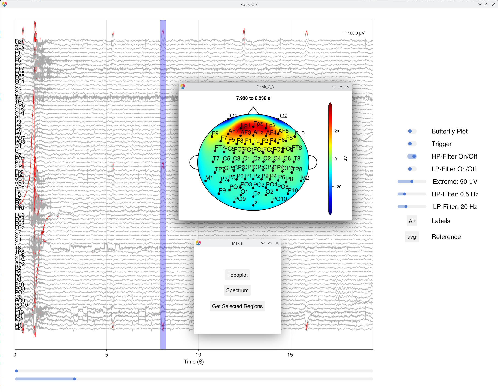
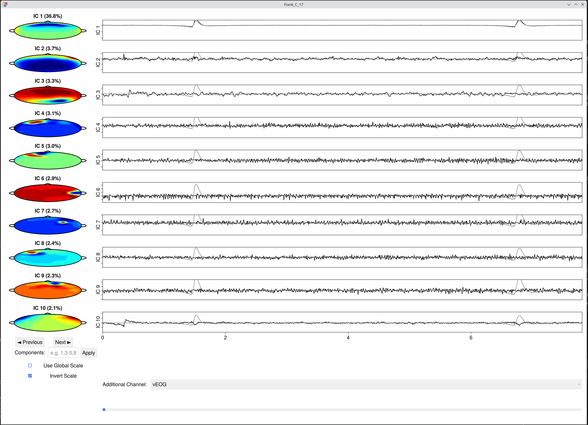
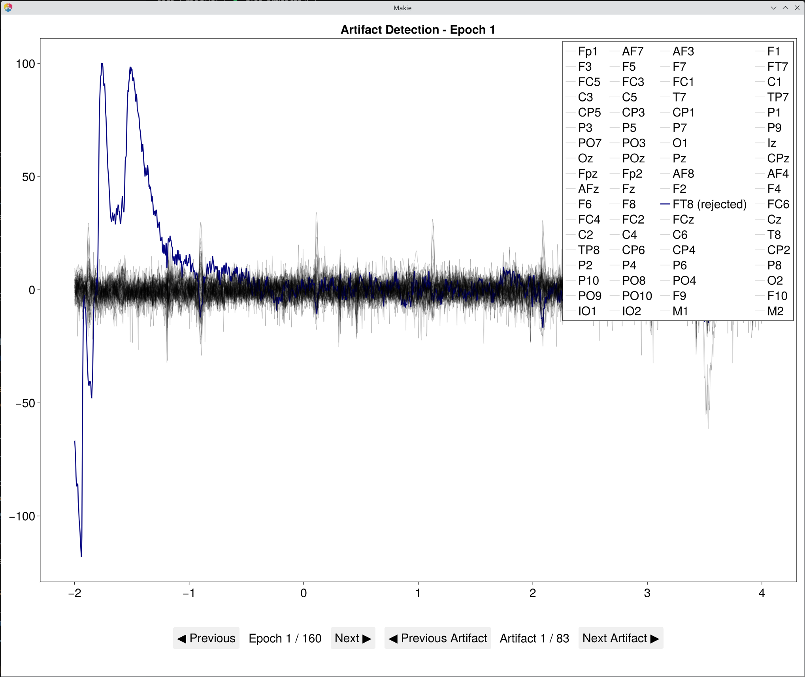
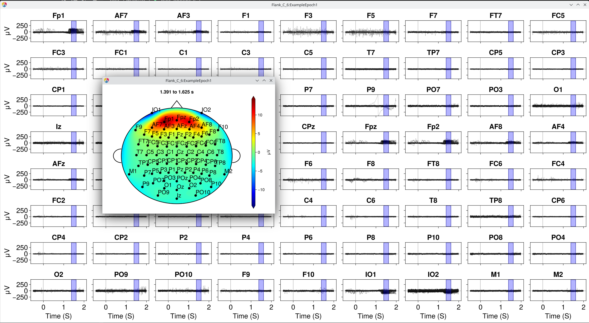
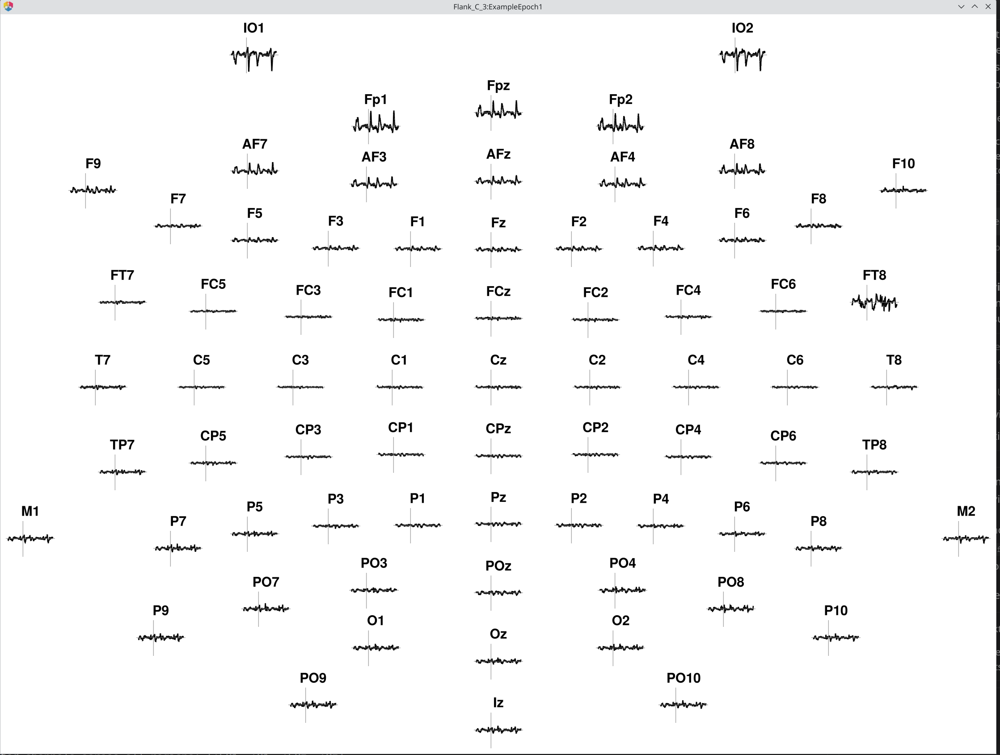
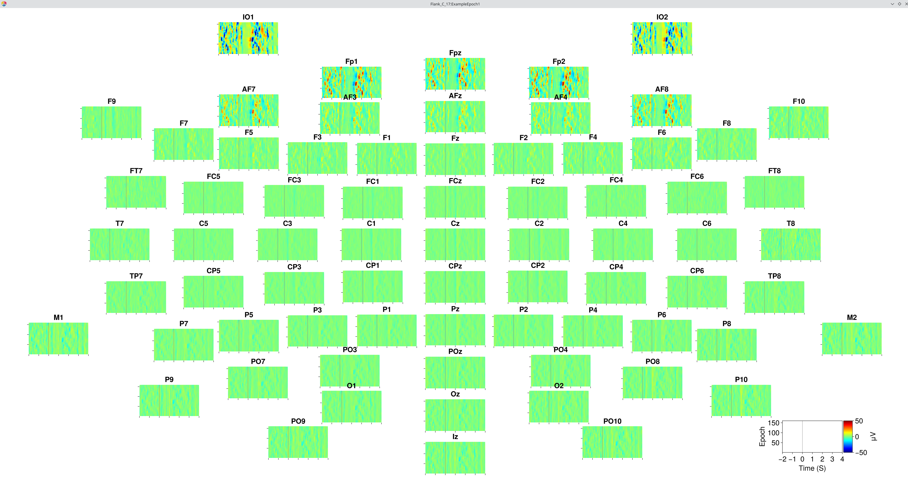

[](https://igmmgi.github.io/EegFun.jl/dev/)
[](https://opensource.org/licenses/MIT)


# EegFun.jl


A Julia package for EEG/ERP data analysis and visualization. Currently under active development (Alpha 0.1).

## Documentation

**[View the full documentation →](https://igmmgi.github.io/EegFun.jl/dev/)**

The documentation includes:

* Getting started guide and installation instructions
* Interactive demos and tutorials
* Complete API reference

## Features

* **EEG/ERP Analysis**
* **EEG/ERP Interactive Plots (via Makie.jl)**
* **Time-Frequency Analysis**
* **Raw data to full ERP batch preprocessing pipelines**

## Some Features

### Data Browser

<details>
<summary>Show Code</summary>

```julia
using EegFun

# raw data file and channel coordinates
dat = EegFun.read_raw_data("my_raw_file.bdf");
layout_file = EegFun.read_layout("my_layout.csv");
EegFun.polar_to_cartesian_xy!(layout_file)

# Julia EegFun type
dat = EegFun.create_eeg_dataframe(dat, layout_file);

EegFun.plot_databrowser(dat);
```

</details>



### ICA Data Browser

<details>
<summary>Show Code</summary>

```julia
using EegFun

# raw data file and channel coordinates
dat = EegFun.read_raw_data("my_raw_file.bdf");

layout_file = EegFun.read_layout("my_layout.csv");
EegFun.polar_to_cartesian_xy!(layout_file)

dat = EegFun.create_eeg_dataframe(dat, layout_file);

# rereference data and apply 1Hz high-pass filter for ICA
EegFun.rereference!(dat, :avg)
EegFun.highpass_filter!(dat, 1)

# calculate EOG channels
EegFun.channel_difference!(
    dat,
    channel_selection1 = EegFun.channels([:Fp1, :Fp2]),
    channel_selection2 = EegFun.channels([:IO1, :IO2]),
    channel_out = :vEOG,
); # vertical EOG = mean(Fp1, Fp2) - mean(IO1, I02)
EegFun.channel_difference!(
    dat,
    channel_selection1 = EegFun.channels([:F9]),
    channel_selection2 = EegFun.channels([:F10]),
    channel_out = :hEOG,
); # horizontal EOG = F9 - F10

# detect some extreme values
EegFun.is_extreme_value!(dat, 200);

# ICA on continuous data without extreme values
ica_result = EegFun.run_ica(dat; sample_selection = EegFun.samples_not(:is_extreme_value_200)) 

EegFun.plot_ica_component_activation(dat, ica_result)
```

</details>



### Plot Examples

#### Artifact Detection



<details>
<summary>More Plot Examples</summary>

#### Epoch Plots (Grid Layout)



#### ERP (Topo Layout)



#### ERP Image (Topo Layout)



</details>

## TODO

* Add additional file formats to read_raw_data (currently only Biosemi BDF and BrainVision) []
* Tutorial examples []
* Lots more ....
