[](https://igmmgi.github.io/EegFun.jl/dev/)
[](https://github.com/igmmgi/EegFun.jl/actions/workflows/ci.yml)
[](https://opensource.org/licenses/MIT)


# EegFun.jl


A Julia package for EEG/ERP data analysis and visualization. Currently under active development.

## Documentation

**[View the full documentation →](https://igmmgi.github.io/EegFun.jl/dev/)**

The documentation includes:

* Installation instructions and getting started guide
* Tutorials and Demos
* Complete API reference

## Installation

You can install EegFun.jl through the standard Julia package manager. 

### Standard Installation

From the Julia REPL, enter Pkg mode by pressing `]` and run:

```julia
add EegFun
```

Or using `Pkg` in the code:

```julia
using Pkg
Pkg.add("EegFun")
```

### Development Version (vía GitHub)

To install the latest development version directly from GitHub:

```julia
using Pkg
Pkg.add(url="https://github.com/igmmgi/EegFun.jl")
```

## Features

* **EEG/ERP Analysis**
* **EEG/ERP Interactive Plots (via Makie.jl)**
* **Time-Frequency Analysis**
* **Raw data to full ERP batch preprocessing pipelines**

## Showcase

### Data Browser

<details>
<summary>Show Code</summary>

```julia
using EegFun

# raw data file and channel coordinates
dat = EegFun.read_raw_data("my_raw_file.bdf");
layout_file = EegFun.read_layout("my_layout.csv");
EegFun.polar_to_cartesian_xy!(layout_file)

# Julia EegFun type
dat = EegFun.create_eegfun_data(dat, layout_file);

EegFun.plot_databrowser(dat);
```

</details>

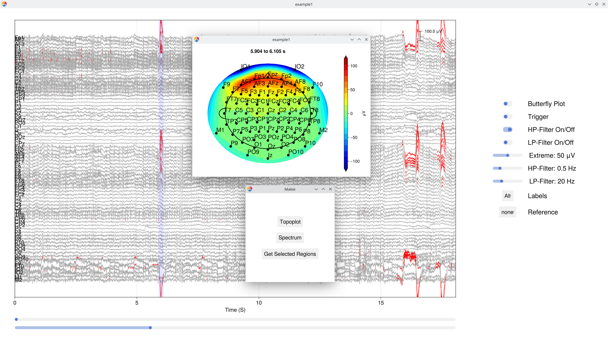

### ICA Data Browser

<details>
<summary>Show Code</summary>

```julia
using EegFun

# raw data file and channel coordinates
dat = EegFun.read_raw_data("my_raw_file.bdf");

layout_file = EegFun.read_layout("my_layout.csv");
EegFun.polar_to_cartesian_xy!(layout_file)

dat = EegFun.create_eegfun_data(dat, layout_file);

# rereference data and apply 1Hz high-pass filter for ICA
EegFun.rereference!(dat, :avg)
EegFun.highpass_filter!(dat, 1)

# calculate EOG channels
EegFun.channel_difference!(
    dat,
    channel_selection1 = EegFun.channels([:Fp1, :Fp2]),
    channel_selection2 = EegFun.channels([:IO1, :IO2]),
    channel_out = :vEOG,
); # vertical EOG = mean(Fp1, Fp2) - mean(IO1, I02)
EegFun.channel_difference!(
    dat,
    channel_selection1 = EegFun.channels([:F9]),
    channel_selection2 = EegFun.channels([:F10]),
    channel_out = :hEOG,
); # horizontal EOG = F9 - F10

# detect some extreme values
EegFun.is_extreme_value!(dat, 200);

# ICA on continuous data without extreme values
ica_result = EegFun.run_ica(dat; sample_selection = EegFun.samples_not(:is_extreme_value_200)) 

EegFun.plot_ica_component_activation(dat, ica_result)
```

</details>

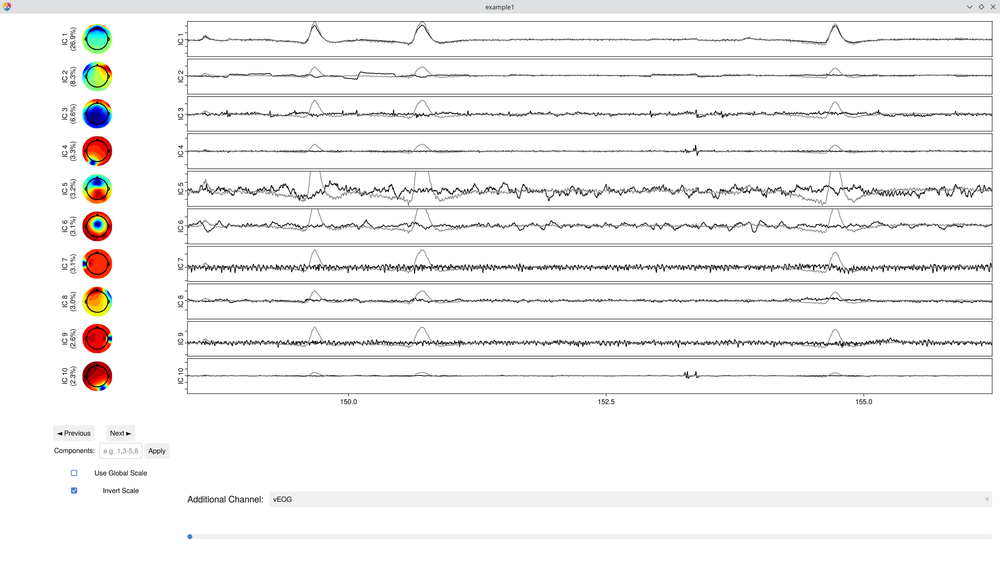

### Plot Gallery

<table>
  <tr>
    <td align="center"><b>Epochs (Grid Layout)</b></td>
    <td align="center"><b>ERP (Topo Layout)</b></td>
  </tr>
  <tr>
    <td>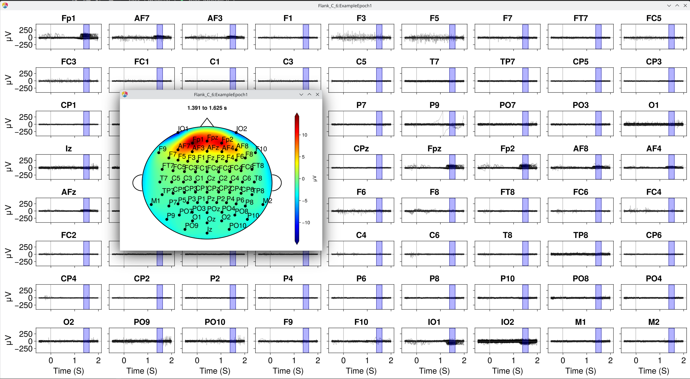</td>
    <td>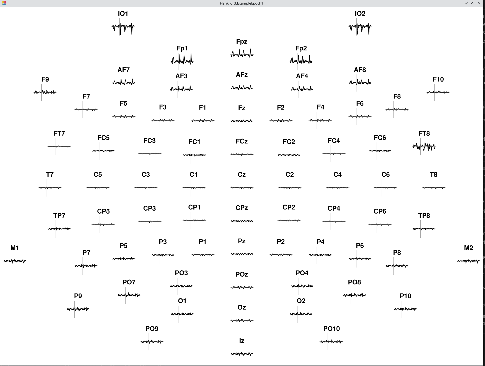</td>
  </tr>
  <tr>
    <td align="center"><b>ICA Component Topographies</b></td>
    <td align="center"><b>ICA Component Spectra</b></td>
  </tr>
  <tr>
    <td>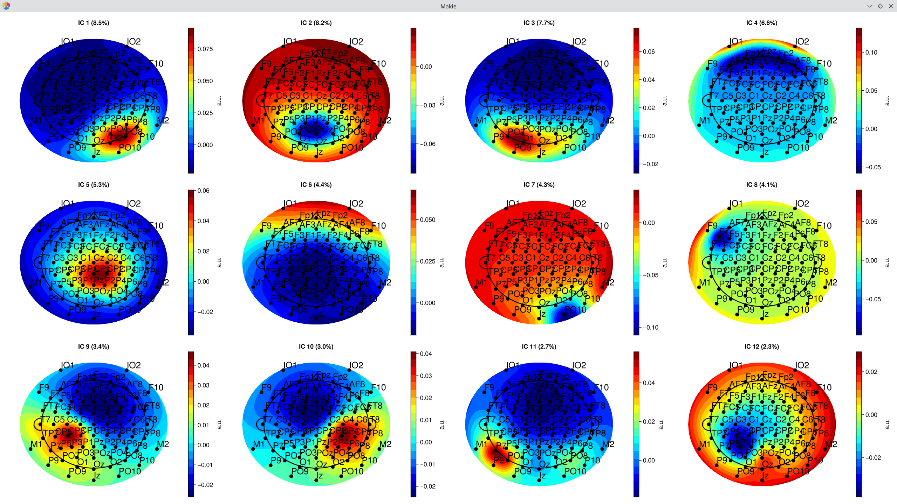</td>
    <td>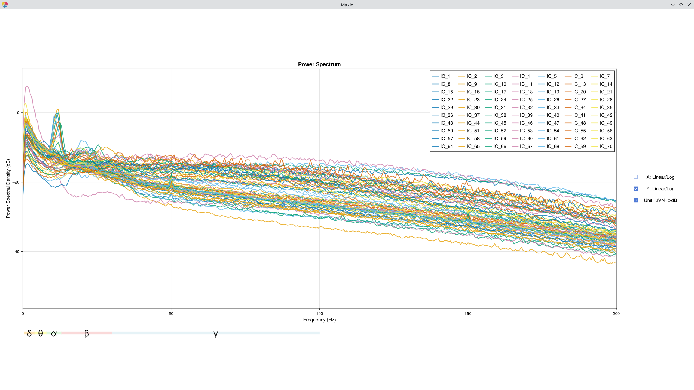</td>
  </tr>
  <tr>
    <td align="center"><b>ERP Measurement GUI</b></td>
    <td align="center"><b>ERP Filter GUI</b></td>
  </tr>
  <tr>
    <td>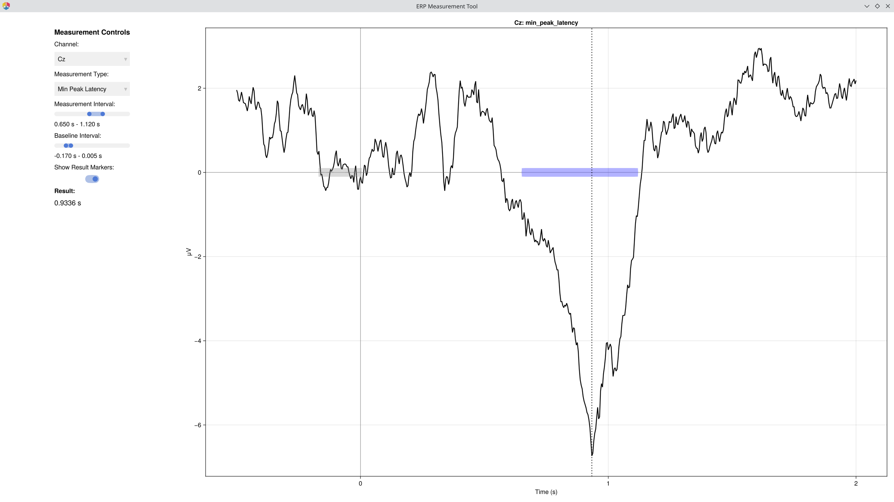</td>
    <td>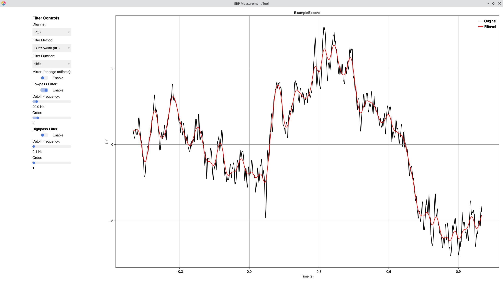</td>
  </tr>
  <tr>
    <td align="center"><b>Time-Frequency Analysis</b></td>
    <td align="center"><b>Triggers</b></td>
  </tr>
  <tr>
    <td>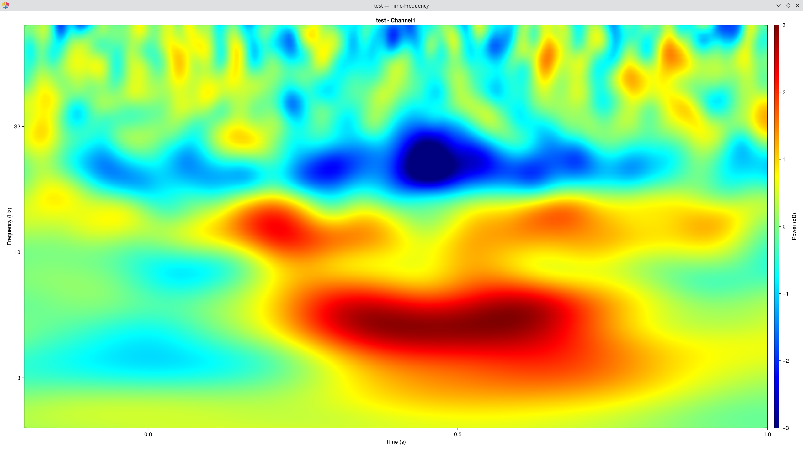</td>
    <td>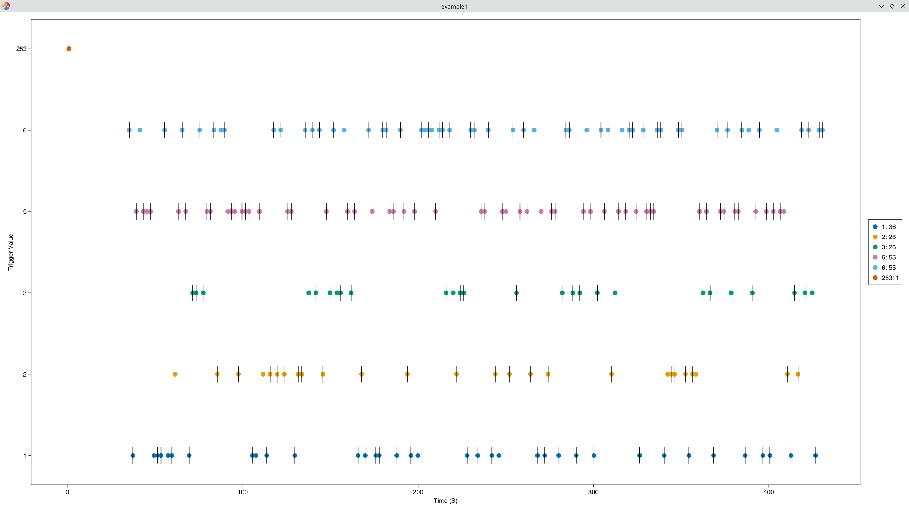</td>
  </tr>
  <tr>
    <td align="center"><b>Plot GUI</b></td>
    <td align="center"><b>Artifact Detection</b></td>
  </tr>
  <tr>
    <td>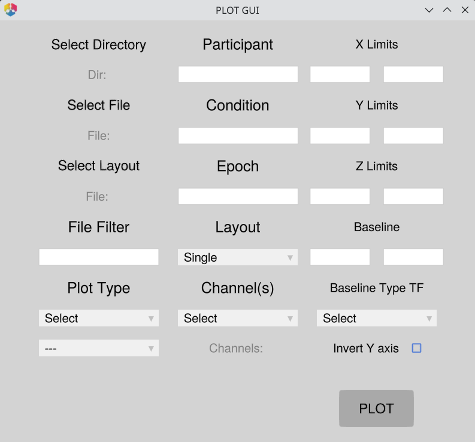</td>
    <td>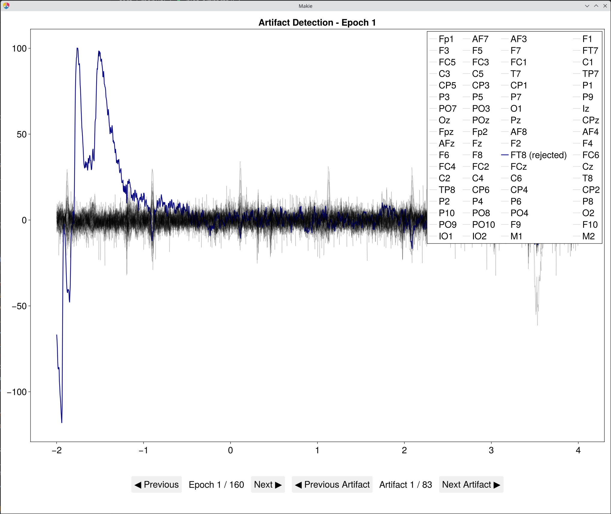</td>
  </tr>
</table>

<details>
<summary><b>More Plot Examples</b></summary>

<details>
<summary>Artifact Detection</summary>


</details>

<details>
<summary>ERP Image (Topo Layout)</summary>

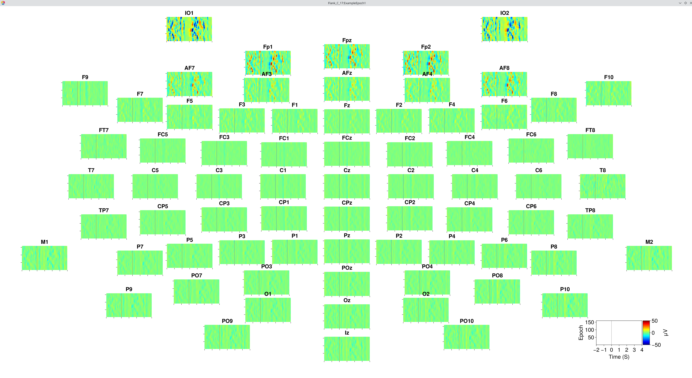

</details>

<details>
<summary>Epoch Plots (Grid Layout)</summary>


</details>

<details>
<summary>ERP (Topo Layout)</summary>


</details>

</details>
