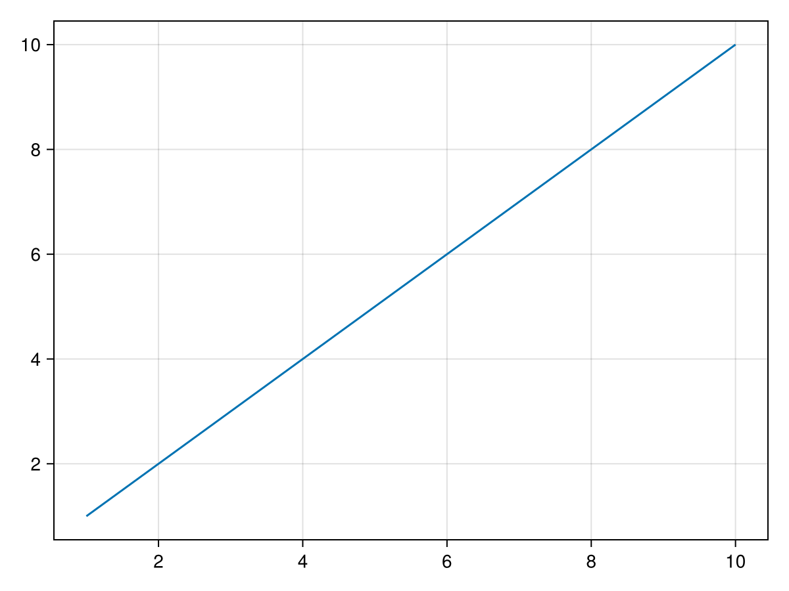

# eegfun Documentation

Welcome to eegfun, a Julia package for EEG/ERP analysis.

## Overview

eegfun provides a complete toolkit for analyzing electroencephalogram (EEG) data, including:

- **Data Loading**: Support for various EEG file formats
- **Preprocessing**: Filtering, referencing, artifact removal
- **Analysis**: Time-frequency analysis, connectivity, statistics
- **Visualization**: Interactive plots and topographic maps
- **Event-Related Potentials**: ERP analysis and visualization

## Getting Started

### Installation

```julia
using Pkg
Pkg.add("eegfun")
```

### Quick Start

```julia
using eegfun

# Load your EEG data
data = load_eeg("your_file.bdf")

# Basic preprocessing
data = filter_data(data, 0.1, 40.0)  # Bandpass filter
data = reference_data(data, :average)  # Average reference

# Create epochs
epochs = epoch_data(data, events, (-0.2, 0.8))

# Compute ERPs
erp = compute_erp(epochs)

# Plot results
plot_erp(erp, ["Fz", "Cz", "Pz"])
```

## Main Data Types

The package provides several core data types for different stages of EEG analysis:

- **ContinuousData**: Raw continuous EEG data
- **EpochData**: Segmented data around events  
- **ErpData**: Event-related potential data

## Package Structure

- **Data Types**: Core data structures for different analysis stages
- **Preprocessing**: Functions for filtering, referencing, and cleaning data
- **Analysis**: Statistical and spectral analysis functions
- **Plotting**: Visualization functions for EEG data
- **Utilities**: Helper functions and utilities 