# Example Experiment: Visual Attention (Posner Cueing)

This tutorial uses a complete example dataset to walk through the EegFun.jl analysis pipeline from raw data exploration through to publication-ready plots and statistical analyses.

## The Experiment

The task is a variation of a standard **Posner cueing paradigm** investigating the neural correlates of endogenous attention allocation. On each trial, participants fixate a central cross, receive a directional cue indicating the likely location (80% valid) of an upcoming target, then respond (simple target detection) to the target.

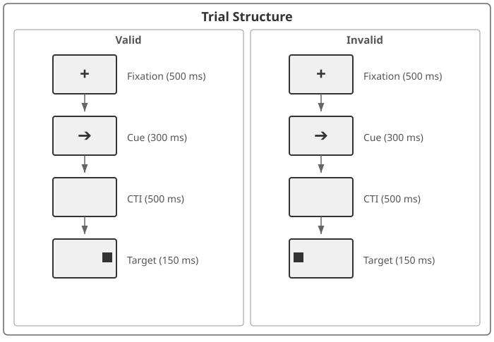

- **Valid trials**: The target appears at the cued location
- **Invalid trials**: The target appears at the uncued location

### Experimental Design

The design is a **2 × 2 within-subjects factorial**:

| Factor         | Levels         |
|:---------------|:---------------|
| **Validity**   | Valid, Invalid  |
| **Target Side**| Left, Right    |

| Trigger | Condition        | Description                |
|:-------:|:-----------------|:---------------------------|
| 1       | `valid_left`     | Cued left → Target left    |
| 2       | `invalid_left`   | Cued right → Target left   |
| 3       | `valid_right`    | Cued right → Target right  |
| 4       | `invalid_right`  | Cued left → Target right   |

### Data

| Property         | Value                        |
|:-----------------|:-----------------------------|
| **Participants** | 12                           |
| **EEG System**   | BioSemi ActiveTwo            |
| **Channels**     | 66 Cap EEG + 4 EOG + 2 Mastoids (72 in total)      |
| **File Format**  | BDF (BioSemi Data Format)    |
| **Sample Rate**  | 256 Hz        |
| **Trials**       | 400 per participant        |

The data files are available on Zenodo:

[](https://doi.org/10.5281/zenodo.19045958)

---

## Part 1: Single Participant Exploration

We start by working with a single file to explore the data, understand the preprocessing steps, and build intuition before scaling to the full dataset.

### 1.1 Load Raw Data

```julia
using EegFun

# Read the raw BDF file and channel layout
dat = EegFun.read_raw_data("example1.bdf")
layout = EegFun.read_layout("biosemi72.csv")

# Create the EegFun data structure
dat = EegFun.create_eegfun_data(dat, layout)
```

### 1.2 Channel Layout and Neighbours

Plot the channel layout to check that electrode positions look correct:

```julia
EegFun.plot_layout_2d(dat)
```

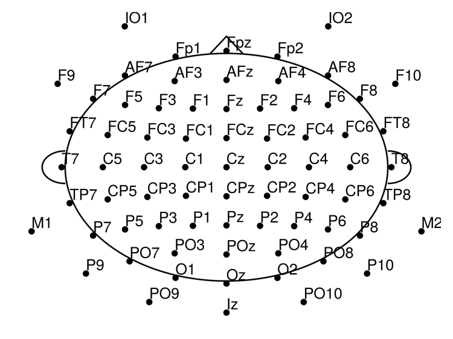


Define channel neighbours (used later potential electrode repair via nearest neighbours, or for cluster based statistics):

```julia
EegFun.get_neighbours_xy!(dat, 0.35)
```

Plot again with neighbour connections (interactive with mouse hover):

```julia
EegFun.plot_layout_2d(dat, neighbours = true)
```

### 1.3 Inspect Triggers

Check which trigger codes are present and how many of each:

```julia
EegFun.trigger_count(dat)
```

| Trigger | Count | Description          |
|:--------|------:|:---------------------|
| 1       | 160   | Valid left (cue)     |
| 2       | 40    | Invalid left (cue)   |
| 3       | 160   | Valid right (cue)    |
| 4       | 40    | Invalid right (cue)  |
| 5       | 400   | Target onset         |

Get a visual overview of the trigger distribution:

```julia
# Trigger overview
EegFun.plot_trigger_overview(dat)
```

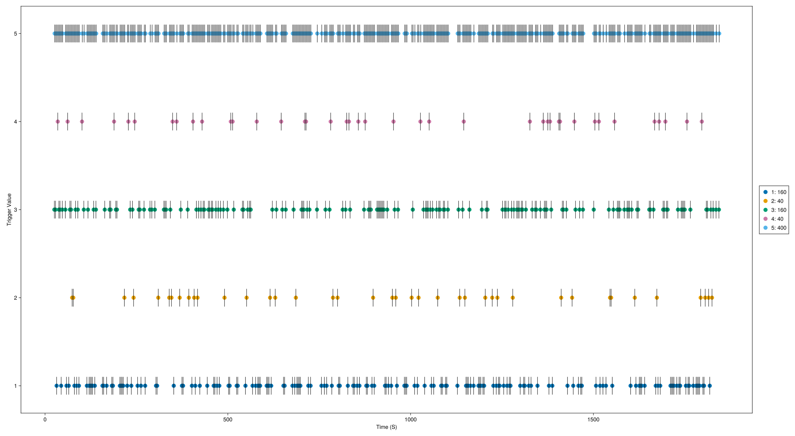


Inspect trigger timing — when each trigger occurred and the interval between triggers:

```julia
# Trigger timing
EegFun.plot_trigger_timing(dat)
```

You should see triggers 1–4 corresponding to the four cueing conditions, with trigger 5 appearing at 800 ms after each cue trigger.

### 1.4 Browse the Raw Data

The databrowser lets you scroll through the continuous recording and visually inspect data quality:

```julia
EegFun.plot_databrowser(dat)
```

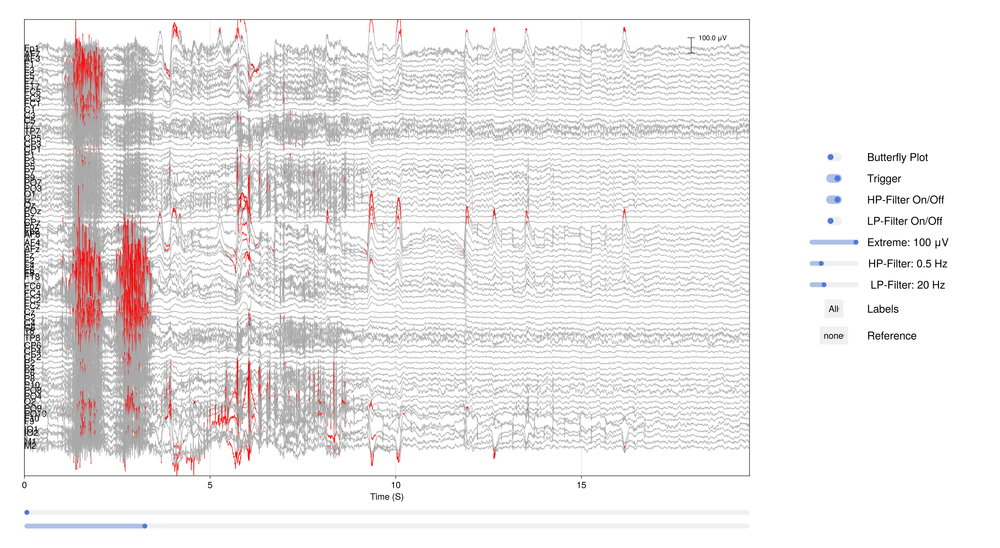

Before going further, remove the DC offset with a high-pass filter and rereference to the average — this makes the traces much easier to read:

```julia
# Remove DC offset
EegFun.highpass_filter!(dat, 0.1)

# Rereference to the average of all channels
EegFun.rereference!(dat, :avg)

# Plot again to see the effect
EegFun.plot_databrowser(dat)
```

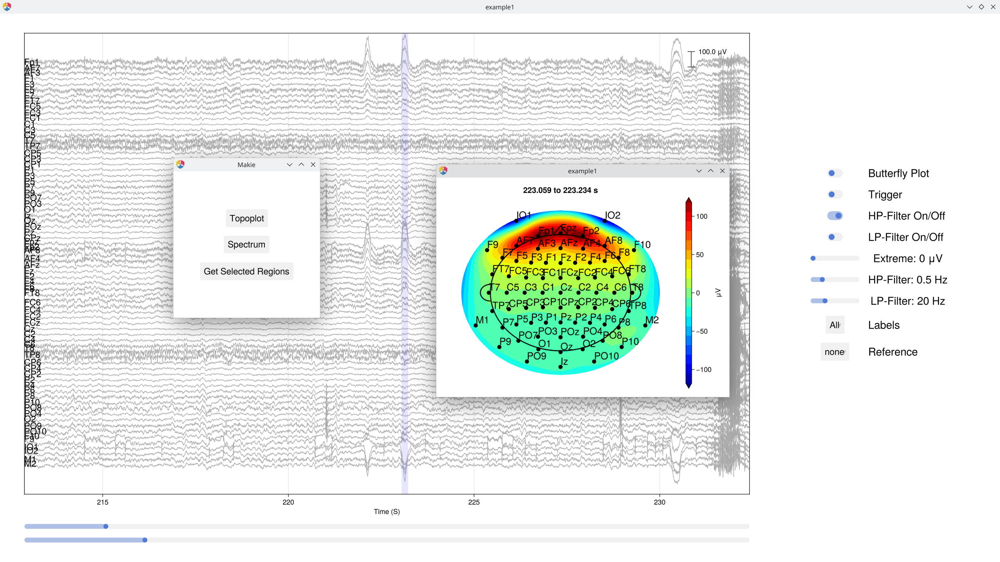

> [!TIP]
> Look for obvious artifacts: flat channels, excessive drift, large muscle movements. This gives you a feel for data quality before automated processing.
> [!IMPORTANT]
> Preprocessing is not magic. While some artifacts can be repaired, there is no substitute for collecting clean data. Careful data collection is one of the most important steps in any EEG study.

The databrowser also supports interactive topographic maps and channel spectra — click on any time point to see the scalp topography, or select a channel to view its power spectrum.

### 1.5 Derive EOG Channels

The raw recording includes four EOG electrodes (IO1, IO2, F9, F10) placed around the eyes. By computing the difference between electrode pairs we get clean vertical and horizontal EOG signals that make blinks and saccades easy to spot:

```julia
# Vertical EOG: average of upper channels minus average of lower channels
EegFun.channel_difference!(
    dat,
    channel_selection1 = EegFun.channels([:Fp1, :Fp2]),
    channel_selection2 = EegFun.channels([:IO1, :IO2]),
    channel_out = :vEOG,
)
# Horizontal EOG: left minus right
EegFun.channel_difference!(
    dat,
    channel_selection1 = EegFun.channels([:F9]),
    channel_selection2 = EegFun.channels([:F10]),
    channel_out = :hEOG,
)
```

Next, automatically detect EOG onsets and mark the surrounding interval as contaminated. This creates Boolean columns (`:is_vEOG`, `:is_hEOG`) that the databrowser draws as vertical markers/shaded regions:

```julia
EegFun.detect_eog_onsets!(dat, 50, :vEOG, :is_vEOG)
EegFun.detect_eog_onsets!(dat, 50, :hEOG, :is_hEOG)
```

The new `:vEOG` and `:hEOG` channels appear under the **Extra Channels** tab in the databrowser, so you can scroll through the recording and verify that blinks and saccades are captured correctly.

### 1.6 Visualise Epoch Regions

Before extracting epochs, it is useful to see where they would land on the continuous recording. `mark_epoch_intervals!` creates a Boolean channel that marks every sample falling within a time window around each trigger:

```julia
# Mark the epoch window (−1000 ms to 1000 ms) around every target trigger (5)
EegFun.mark_epoch_intervals!(dat, [5], [-0.5, 1.0])

# Browse again — the epoch regions now appear as shaded overlays
EegFun.plot_databrowser(dat)
```

The highlighted regions let you quickly check whether epoch boundaries overlap, whether any epochs contain obvious artifacts, and whether the trigger timing looks correct.


### 1.7 Channel Quality and Extreme Values

Use `channel_summary` to get a quick overview of each channel's range, variance, and standard deviation — this helps spot noisy or flat channels:

```julia
# Summary across the entire recording
cs = EegFun.channel_summary(dat)

# Summary restricted to only the epoch regions we just marked
cs_epoch = EegFun.channel_summary(dat,
    sample_selection = EegFun.samples(:epoch_interval)
)

# Visualise with a bar chart
EegFun.plot_channel_summary(cs, :range)
EegFun.plot_channel_summary(cs, [:range, :min, :max, :var])
EegFun.plot_channel_summary(cs_epoch, :range)
```

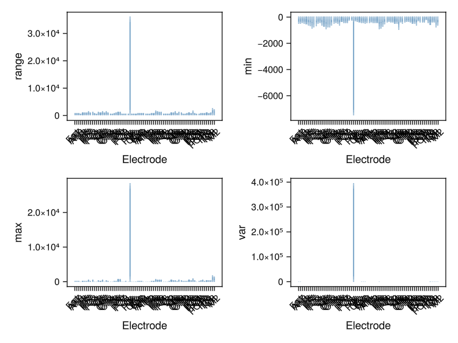

Next, flag every sample where **any** channel exceeds ±200 μV. This creates a Boolean column (`:is_extreme_value_200`) that the databrowser renders as shaded overlays:

```julia
# Mark extreme samples
EegFun.is_extreme_value!(dat, 200)

# Browse — extreme-value regions now appear as red highlights
EegFun.plot_databrowser(dat)
```

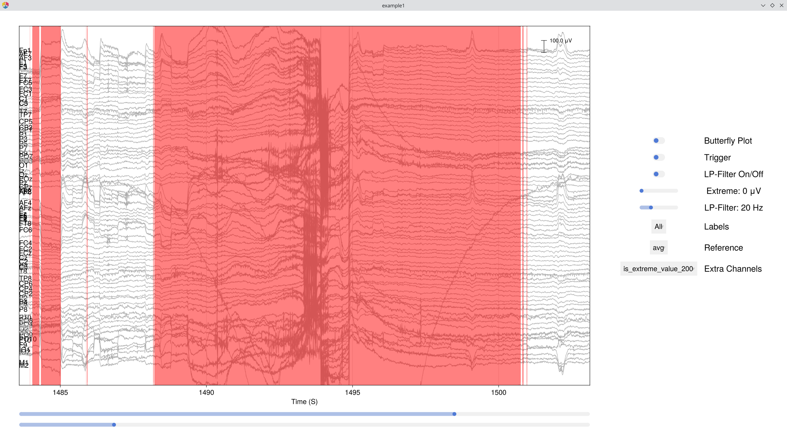

### 1.8 Detect and Repair Bad Channels

Combine the channel summary and joint probability metrics to automatically flag potential bad channels:

```julia
# Channel summary and joint probability across the whole recording
cs = EegFun.channel_summary(dat)
jp = EegFun.channel_joint_probability(dat)

# Or restrict to just the epoch regions — often more relevant
cs = EegFun.channel_summary(dat,
    sample_selection = EegFun.samples(:epoch_interval)
)
jp = EegFun.channel_joint_probability(dat,
    sample_selection = EegFun.samples(:epoch_interval)
)

# Identify bad channels (high z-variance or high joint probability)
bad_channels = EegFun.identify_bad_channels(cs, jp)
```

If any channels are flagged, you can repair them interactively in the databrowser. Press **R** to open the channel repair menu, which lets you select the repair method (neighbour interpolation or spherical spline) and apply it immediately:

```julia
EegFun.plot_databrowser(dat)
# → Press R to open the repair menu
```

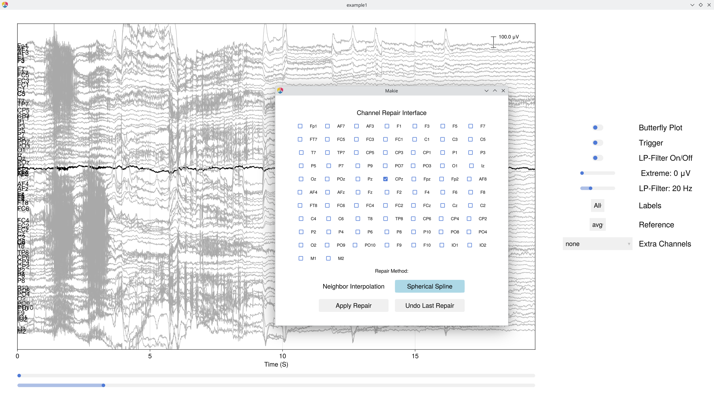

### 1.9 ICA

First, mark extreme values on the main data — these will be excluded from ICA training and component identification:

```julia
# Mark extreme values on the original data (used for ICA exclusion)
EegFun.is_extreme_value!(dat, 250)
```

ICA works best on data that has been high-pass filtered (e.g., ≥ 1 Hz). We copy the data, apply a stricter filter, and exclude extreme samples so the decomposition focuses on genuine brain and artifact sources:

```julia
# Copy data and apply stricter filter for ICA
dat_ica = copy(dat)
EegFun.highpass_filter!(dat_ica, 1.0)

# Run ICA, excluding extreme samples
ica_result = EegFun.run_ica(dat_ica,
    sample_selection = EegFun.samples_not(:is_extreme_value_250)
)

# For long recordings, subsample can be used to speed up ICA:
# ica_result = EegFun.run_ica(dat_ica,
#     sample_selection = EegFun.samples_not(:is_extreme_value_250),
#     percentage_of_data = 25.0
# )
```

Inspect the component topographies and time-course activations:

```julia
# Component topographies 
EegFun.plot_topography(ica_result, component_selection = EegFun.components(1:10));
EegFun.plot_ica_component_activation(dat, ica_result)
```

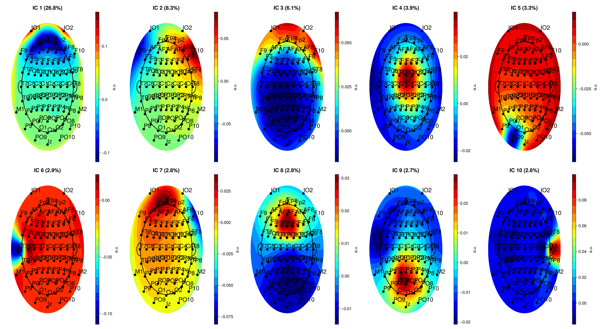
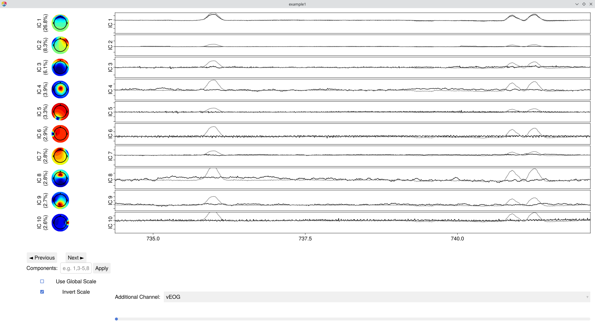

Components are ordered by the percentage of total variance they explain — the first few typically capture the most prominent signals or artifacts. In most EEG recordings, the largest components are **vertical EOG activity** (eye blinks, showing a frontal topography) and **horizontal eye movements** (lateral frontal pattern). Standard ERP analyses use ICA primarily to remove these ocular components so that the cleaned data better reflects neural activity.

You can immediately browse the data with ICA components overlaid — this lets you see each component's contribution to the signal and toggle removal interactively:

```julia
EegFun.plot_databrowser(dat, ica_result)
```

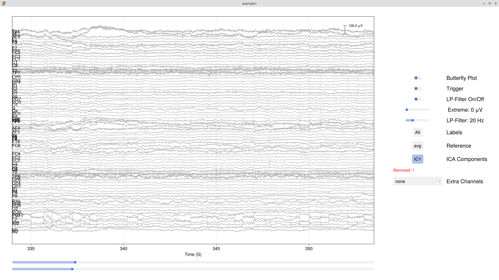

Automatically identify artifact components via EOG correlation and spatial kurtosis:

```julia
# Identify artifact components (excluding extreme samples)
component_artifacts, component_metrics = EegFun.identify_components(dat, ica_result,
    sample_selection = EegFun.samples_not(:is_extreme_value_250)
)

# Inspect with artifact labels overlaid (can be used to easily select automatically identified components)
EegFun.plot_ica_component_activation(dat, ica_result, artifacts = component_artifacts)
```

Remove the identified components and verify the cleaned data in the databrowser:

```julia
# Remove artifact components from the original (0.1 Hz filtered) data
all_removed = EegFun.get_all_ica_components(component_artifacts)
EegFun.remove_ica_components!(dat, ica_result,
    component_selection = EegFun.components(all_removed)
)
```

### 1.10 Define Epoch Conditions

Define the epoch conditions directly in Julia. Each condition maps a cue trigger to a descriptive label — we will epoch around trigger 5 (target onset = 0), with the cue identity telling us which condition each trial belongs to:

```julia
epoch_conditions = [
    EegFun.EpochCondition(name = "valid_left",    trigger_sequences = [[1, 5]], reference_index = 2),
    EegFun.EpochCondition(name = "invalid_left",  trigger_sequences = [[2, 5]], reference_index = 2),
    EegFun.EpochCondition(name = "valid_right",   trigger_sequences = [[3, 5]], reference_index = 2),
    EegFun.EpochCondition(name = "invalid_right", trigger_sequences = [[4, 5]], reference_index = 2),
]
```

Each `EpochCondition` specifies:

- **`name`** — a descriptive label for the condition
- **`trigger_sequences`** — the trigger pattern to match (here cue → target)
- **`reference_index`** — which trigger in the sequence is t = 0 (2 = the target onset)

> [!TIP]
> For batch processing, you can define these same conditions in a TOML file and load them with `EegFun.read_epoch_conditions("epochs.toml")` — we'll cover this in Part 2.

### 1.11 Extract Epochs

```julia
# Extract epochs: 500 ms pre-target to 1000 ms post-target
epochs = EegFun.extract_epochs(dat, epoch_conditions, (-0.5, 1.0))

# Baseline correction (200 ms pre-target)
EegFun.baseline!(epochs, (-0.2, 0.0))
```

Before running artifact rejection, inspect the single-trial data. `plot_epochs` offers several layouts — a single channel overlay, a grid of all channels, or a topographic arrangement:

```julia
# Example plots with epoched data
# Single-trial waveforms at one channel
EegFun.plot_epochs(epochs, condition_selection = EegFun.conditions(1), channel_selection = EegFun.channels(:PO7))

# All channels in a grid
EegFun.plot_epochs(epochs, condition_selection = EegFun.conditions(1), layout = :grid)

# Topographic layout
EegFun.plot_epochs(epochs, condition_selection = EegFun.conditions(2), layout = :topo)
```

### 1.12 Reject Artifacts

Two-stage artifact rejection — first repair channels that can be repaired (interpolated), then reject remaining bad epochs:

```julia
rejection_info = EegFun.detect_bad_epochs_automatic(epochs, abs_criterion = 100.0, z_criterion = 0.0)

# Inspect which epochs and channels were flagged
EegFun.plot_artifact_detection(epochs[1], rejection_info[1]) # Condition 1
EegFun.plot_artifact_detection(epochs[2], rejection_info[2]) # Condition 2
```

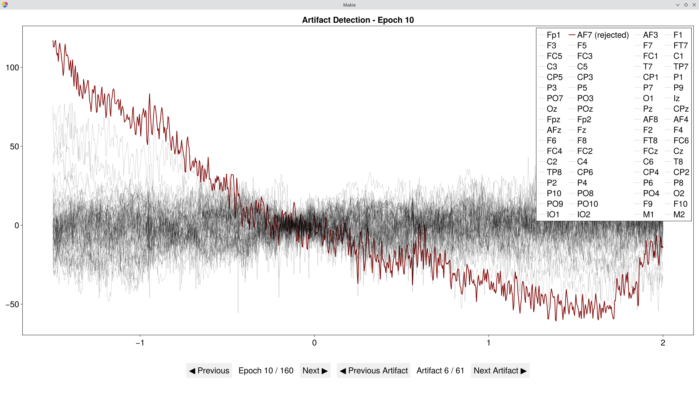

```julia
# Repair channels that can be interpolated
EegFun.channel_repairable!(rejection_info, epochs[1].layout)
EegFun.repair_artifacts!(epochs, rejection_info)

# Second pass on repaired data
rejection_info2 = EegFun.detect_bad_epochs_automatic(epochs, abs_criterion = 100.0, z_criterion = 0.0)

# Visually review epochs in a grid — automatically detected artifacts are pre-checked
EegFun.detect_bad_epochs_interactive(epochs[1], artifact_info = rejection_info2[1], dims = (3, 3))
```

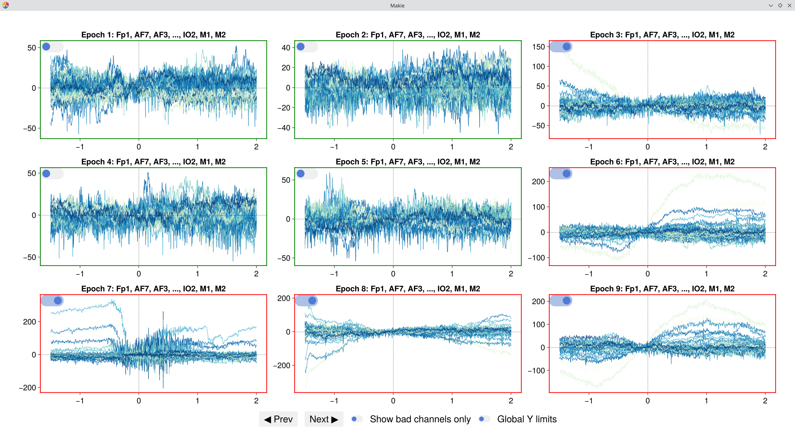

```julia
# Accept the rejection and keep only good epochs
epochs_final = EegFun.reject_epochs(epochs, rejection_info2)
```

### 1.13 Average and Plot Single-Participant ERPs

```julia
erps = EegFun.average_epochs(epochs_final)

# Plot all conditions at posterior sites
EegFun.plot_erp(erps, channel_selection = EegFun.channels([:PO7, :PO8, :O1, :O2]))

# Topography at the P1 time window (peak posterior negativity)
EegFun.plot_topography(erps, interval_selection = EegFun.times(0.10))
```

---

## Part 2: Batch Processing and Group Analysis

### File Organisation

```text
AttentionExp/
├── example1.bdf ... example16.bdf    # Raw BDF files (one per participant)
├── biosemi72.csv                     # Channel layout (label, inclination, azimuth)
├── epochs.toml                       # Epoch condition definitions
├── pipeline.toml                     # Preprocessing pipeline configuration
└── output_data/                      # Preprocessed output (after batch processing)
```

The walk-through in Part 1 gave you the general idea of a single-participant analysis pipeline — loading data, filtering, ICA, epoch extraction, artifact rejection, and ERP averaging. In practice, we want to run these steps automatically across all participants so that every file receives the same analysis in a consistent, reproducible way. Visual inspection of the raw data and of the individual-level outputs remains important, but the automated pipeline ensures a uniform setup that is easy to document and log.

> [!NOTE]
> The pipeline below uses `preprocess`, which provides sensible defaults for a standard ERP analysis. If you need a different set of steps or parameters, you can generate a fully customisable pipeline scaffold with `EegFun.generate_pipeline_template("my_pipeline.jl", "my_preprocess")` and a matching configuration file with `EegFun.generate_config_template(filename = "my_config.toml")`. The template provides all the boilerplate — logging, configuration loading, file iteration, and error handling — so you can focus on combining the lower-level functions from Part 1 (filtering, ICA, epoching, artifact rejection, etc.) into your own processing sequence.

### 2.1 Batch Preprocessing

The `preprocess` pipeline automates all single-participant steps across every BDF file:

```julia
EegFun.preprocess("pipeline.toml")
```

For each participant, the pipeline runs through the following stages:

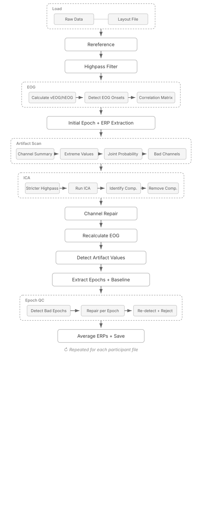
*↻ Repeated for each participant file*

| # | Stage | Description |
|---|-------|-------------|
| 1 | **Load** | Read raw BDF file and apply electrode layout |
| 2 | **Rereference** | Apply the chosen reference (e.g., average, mastoid) |
| 3 | **Filter** | High-pass filter the continuous data (e.g., 0.1 Hz) |
| 4 | **EOG** | Calculate vEOG / hEOG, detect onsets, compute channel–EOG correlations |
| 5 | **Initial Epochs** | Extract preliminary epochs and ERPs (before cleaning) |
| 6 | **Artifact Scan** | Channel summary, extreme-value detection, joint probability, bad-channel identification |
| 7 | **ICA** | Apply stricter high-pass filter (on copy of data), decompose, auto-identify artifact components (e.g., EOG, ECG), remove them |
| 8 | **Channel Repair** | Interpolate bad channels (previously removed) from their neighbours (or spline interpolation) |
| 9 | **Recalculate EOG** | Recompute vEOG / hEOG after ICA and channel repair |
| 10 | **Artifact Values** | Re-detect extreme values on cleaned continuous data (used for epoch exclusion) |
| 11 | **Epoch + Baseline** | Cut cleaned continuous data into trial segments and baseline-correct |
| 12 | **Epoch QC** | Detect bad epochs, attempt per-epoch channel repair, re-detect and reject remaining artifacts |
| 13 | **Average & Save** | Compute ERPs per condition and save all outputs to `output_data/` |

#### Key Default Parameters

The most commonly adjusted parameters are shown below. The full configuration (with all available options) can be generated with `EegFun.generate_config_template(filename = "my_config.toml")`.

| Section | Parameter | Default | Description |
|---------|-----------|---------|-------------|
| **Epochs** | `epoch_start` | −1 s | Epoch start relative to trigger |
| | `epoch_end` | 1 s | Epoch end relative to trigger |
| **Reference** | `reference_channel` | `avg` | Reference type (avg, mastoid, etc.) |
| **Highpass** | `filter.highpass.freq` | 0.1 Hz | Main highpass cutoff |
| **Lowpass** | `filter.lowpass.apply` | `false` | Lowpass off by default |
| | `filter.lowpass.freq` | 30 Hz | Lowpass cutoff (if enabled) |
| **ICA** | `ica.apply` | `true` | ICA on by default |
| | `filter.ica_highpass.freq` | 1.0 Hz | Stricter highpass for ICA |
| | `ica.percentage_of_data` | 100% | Proportion of data used for ICA |
| **Artifacts** | `eeg.extreme_value_abs_criterion` | 500 μV | Extreme value threshold (continuous) |
| | `eeg.artifact_value_abs_criterion` | 100 μV | Artifact threshold (epoch rejection) |
| **EOG** | `eog.vEOG_channels` | Fp1/Fp2 − IO1/IO2 | Vertical EOG electrode pairs |
| | `eog.hEOG_channels` | F9 − F10 | Horizontal EOG electrode pairs |
| **Layout** | `layout.neighbour_criterion` | 0.35 | Distance for neighbour definition |

::: details Full default configuration (click to expand)

```toml
# ──── Files ────

[files.input]
directory = "."
epoch_condition_file = ""
layout_file = "biosemi72.csv"
raw_data_files = "\\.bdf"

[files.output]
directory = "./preprocessed_files"
save_continuous_data_raw = true
save_continuous_data_corrected = true
save_epoch_data_uncorrected = true
save_epoch_data_unrejected = true
save_epoch_data_final = true
save_erp_data_uncorrected = true
save_erp_data_unrejected = true
save_erp_data_final = true
save_ica_data = true

# ──── Preprocessing ────

[preprocess]
epoch_start = -1
epoch_end = 1
reference_channel = "avg"

[preprocess.eeg]
extreme_value_abs_criterion = 500    # μV — flags extreme samples
artifact_value_abs_criterion = 100   # μV — epoch rejection threshold
artifact_value_z_criterion = 0       # z-score (0 = off)

[preprocess.eog]
vEOG_channels = [["Fp1", "Fp2"], ["IO1", "IO2"], ["vEOG"]]
vEOG_criterion = 50
hEOG_channels = [["F9"], ["F10"], ["hEOG"]]
hEOG_criterion = 30

# ──── Filters ────

[preprocess.filter.highpass]
apply = true
freq = 0.1
order = 1
method = "iir"
func = "filtfilt"
type = "hp"

[preprocess.filter.lowpass]
apply = false
freq = 30.0
order = 3
method = "iir"
func = "filtfilt"
type = "lp"

[preprocess.filter.ica_highpass]
apply = true
freq = 1.0
order = 1
method = "iir"
func = "filtfilt"
type = "hp"

[preprocess.filter.ica_lowpass]
apply = false
freq = 30.0
order = 3
method = "iir"
func = "filtfilt"
type = "lp"

# ──── ICA ────

[preprocess.ica]
apply = true
percentage_of_data = 100.0

# ──── Layout ────

[preprocess.layout]
neighbour_criterion = 0.25
```

:::

### 2.2 Batch Filter ERPs

Apply a low-pass filter to the saved ERP files (e.g., 30 Hz for clean plotting):

```julia
EegFun.lowpass_filter("erps_final", 30)
```

The interactive filter GUI lets you preview the effect of different filter settings before applying them in batch:

```julia
EegFun.plot_erp_filter_gui("example1_erps_final.jld2")
```

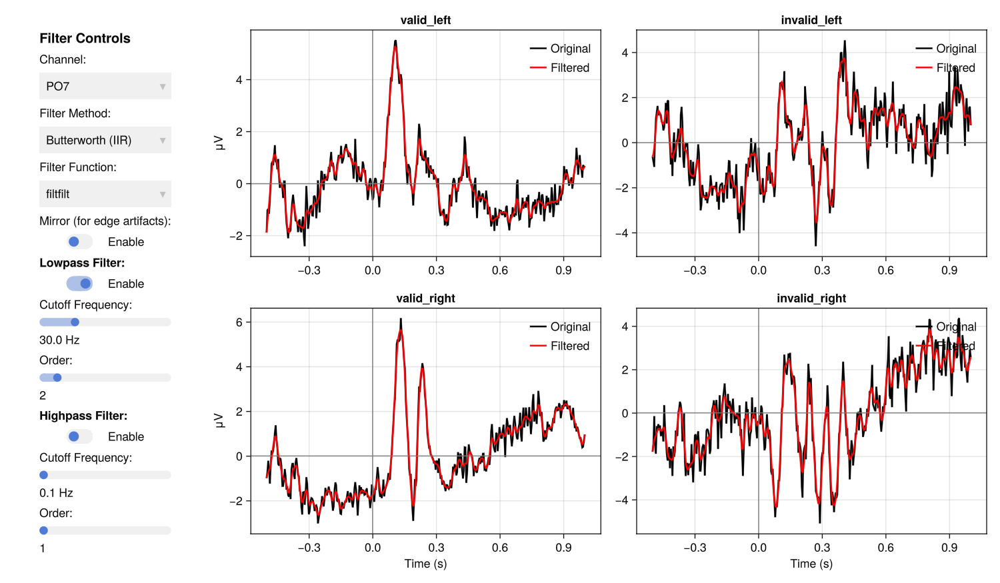

This creates a new directory `filtered_erps_final_lp_30hz/` with filtered copies of each participant's ERPs.

> [!TIP]
> Batch functions like `lowpass_filter`, `condition_average`, `condition_difference`, and `grand_average` automatically create an output directory named after the operation and its parameters (e.g., `filtered_erps_final_lp_30hz/`, `averages_erps_final_1-3_2-4/`). To save to a different location/folder name, pass the `output_dir` keyword argument.

### 2.3 Grand Average

Compute the grand average across all participants:

```julia
EegFun.grand_average("erps_final")


# Plotting the grandaverage across parietal/occipital electrodes
EegFun.plot_erp("grand_average_erps_final.jld2", channel_selection = EegFun.channels([:PO7, :PO8]))

# but we want to baseline the data
EegFun.plot_erp("grand_average_erps_final.jld2", channel_selection = EegFun.channels([:PO7, :PO8]), baseline_interval = (-0.2, 0))

# and lets make separate plot for each channel
EegFun.plot_erp("grand_average_erps_final.jld2", channel_selection = EegFun.channels([:PO7, :PO8]), baseline_interval = (-0.2, 0), layout = :grid, layout_grid_dims = (1,2))
```

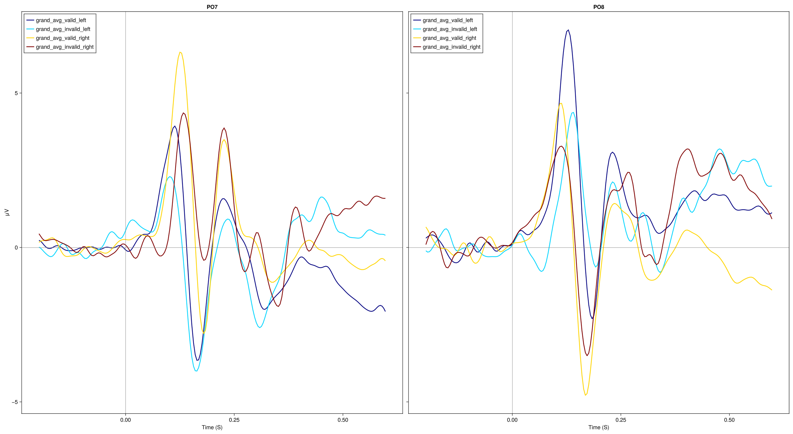

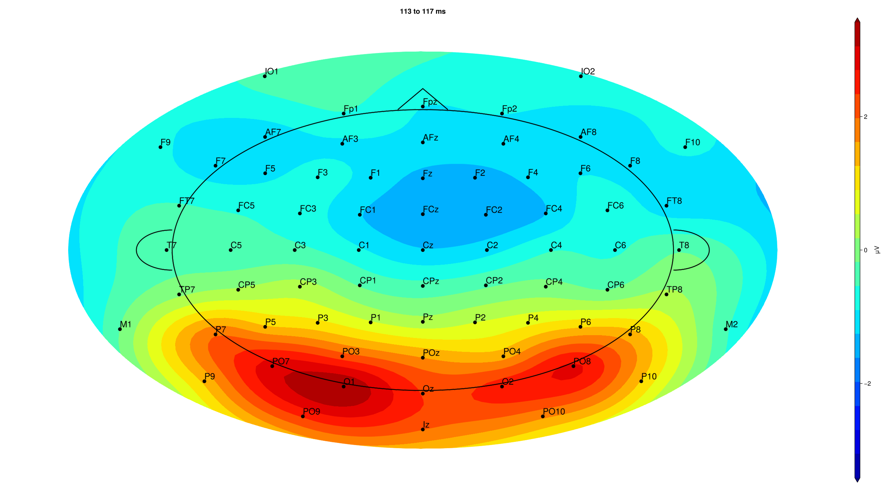

### 2.4 Combining Conditions

Sometimes we want to average ERP comditions. For example, we might just want to look at a basic valid vs. invalid comparison.

```julia
# Average conditions: [1,3] = Valid (left+right), [2,4] = Invalid (left+right)
# We will do this here on the individual participant ERP files, then create a grand average.
EegFun.condition_average("erps_final", [[1, 3], [2, 4]])

# Plotting the grandaverage across parietal/occipital electrodes
EegFun.grand_average("erps_final")

# and lets make plot averaging across channels
EegFun.plot_erp("grand_average_erps_final.jld2", channel_selection = EegFun.channels([:PO7, :PO8]), baseline_interval = (-0.2, 0), average_channels = true) 

# topography plot for P1 
EegFun.plot_topography("grand_average_erps_final.jld2", baseline_interval = (-0.2, 0), interval_selection = (0.1, 0.1), dims = (1,2), ylim = (-3, 3), 
label_plot = false) 
```

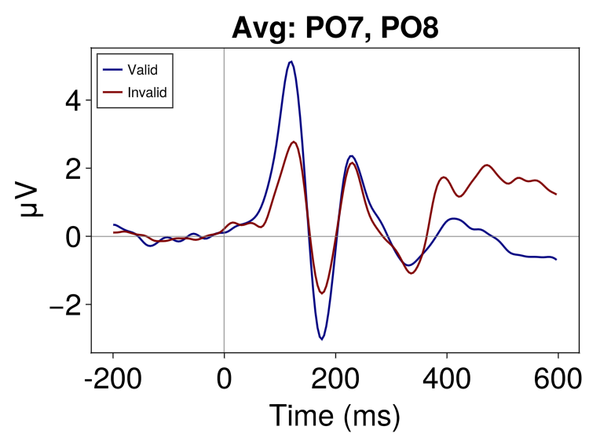
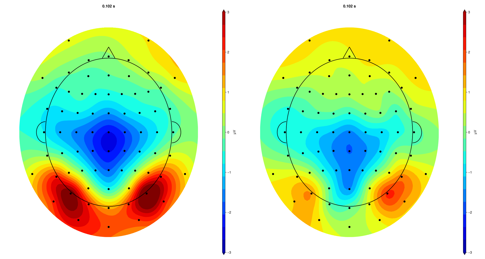

### 2.5 Create Difference Waves

Sometimes we want to plot the diifference between ERP comditions. For example, we might just want to look at the validity effect by computing
the **Invalid − Valid** difference wave:

```julia
# For a basic plot, we can just do this on the averaged data; condition 1 = Valid, condition 2 = Invalid
EegFun.condition_difference("erps_final", [(1, 2)])

# And plot (We now have a single difference wavee)
fig = EegFun.plot_erp("grand_average_erps_final.jld2", channel_selection = EegFun.channels([:PO7, :PO8]), baseline_interval = (-0.2, 0), average_channels = true) 
```

### 2.6 Plot Customisation

Several options are available for plot customisation. As an example, we can change line colour, style, legend labels, and highlight components with the following:

```julia
fig = EegFun.plot_erp("grand_average_erps_final.jld2",
    channel_selection = EegFun.channels([:PO7, :PO8]),
    baseline_interval = (-0.2, 0),
    average_channels = true,
    color = [:black, :grey],
    linestyle = [:solid, :dash],
    legend_labels = ["Valid", "Invalid"],
    highlight_regions = [
        (x1 = 0.09, x2 = 0.14, color = :lightgrey, alpha = 0.25),   # P1 window
        (x1 = 0.15, x2 = 0.20, color = :lightgrey, alpha = 0.25),   # N1 window
    ],
    ylim = (-4, 6),
    xlim = (-0.25, 0.65),
    xticks = -0.2:0.1:0.6,
    time_unit = :ms, 
    title = "Validity Effect (Avg: PO7/PO8)",
)

# and save the figure
save("erp_plot1_custom.png", fig.fig)

# or apply further customisation via Makie
fig.axes[1].titlecolor = :red
fig.axes[1].yticklabelsize = 30
# and so on ...
```

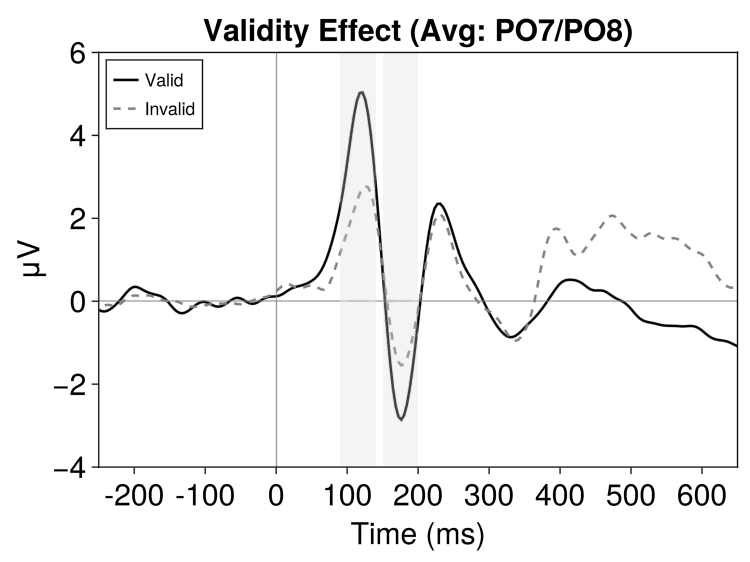

---

## Part 3: Statistical Analysis

To test our hypotheses statistically, we need to extract numerical summaries from each participant's ERP waveforms. Standard ERP measurements fall into two families: **amplitude** measures (e.g., mean amplitude, peak amplitude, area under the curve) that quantify *how large* a component is, and **latency** measures (e.g., peak latency, fractional area latency) that quantify *when* a component occurs.

### 3.1 ERP Measurement GUI

Before extracting measurements in batch, use the interactive GUI to explore where and when to measure:

```julia
# Load a single participant's ERPs
erps = EegFun.read_data("example1_erps_final.jld2")
# Open the measurement GUI
EegFun.plot_erp_measurement_gui(erps)

# or directly with a file name
EegFun.plot_erp_measurement_gui("grand_average_erps_final.jld2")
```

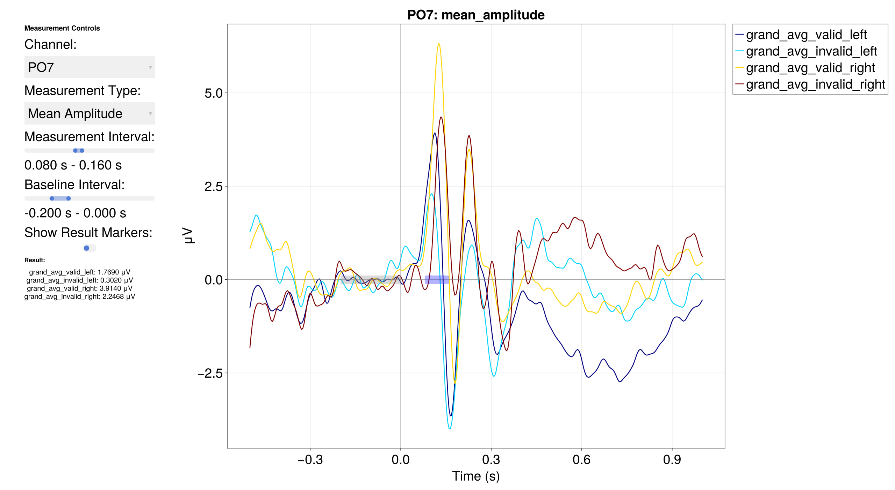

The GUI lets you select channels, time windows, and measurement types interactively to determine optimal parameters before running batch extraction.

> [!WARNING]
> The purpose of this step is to **verify** that your measurement window and type capture the component you intend to measure — not to search for channels or intervals where a difference happens to be significant. Choosing parameters based on observed effects inflates false-positive rates. Define your measurement strategy based on prior literature or orthogonal data, then use the GUI to confirm the settings look sensible.

### 3.2 Extract ERP Measurements

Extract mean amplitude in the P1 window at posterior-occipital sites across all participants:

```julia
mean_amp = EegFun.erp_measurements(
    "erps_final",
    "mean_amplitude",
    channel_selection = EegFun.channels([:PO7, :PO8]),
    analysis_interval = (0.08, 0.12),
    baseline_interval = (-0.2, 0.0),
    average_channels = true
)

# Result is an ErpMeasurementsResult containing a DataFrame
# Columns: participant, condition, PO7, PO8, O1, O2
mean_amp.data
```

### 3.3 Traditional Statistics with AnovaFun

```julia
using AnovaFun

df = mean_amp.data # our DataFrame

# --- Simple comparison (Valid vs. Invalid) via paired t-test/anova at dv_channels (avg of PO7/PO8)
t_result = paired_ttest(df, :dv_channels, by = :condition)
anova_result = anova(df, :dv_channels, :participant, within = [:condition])

plot_anova(anova_result, x_grouping = :condition)
# or with more customisation
plot_anova(anova_result, x_grouping = :condition, individual_data = :connected_points, theme = Theme(palette = (color = [:black],)), 
axis_xlabel = "Validity", axis_ylabel = "Mean P1 Amplitude [μV]", axis_xticklabels = ["Valid", "Invalid"])
```

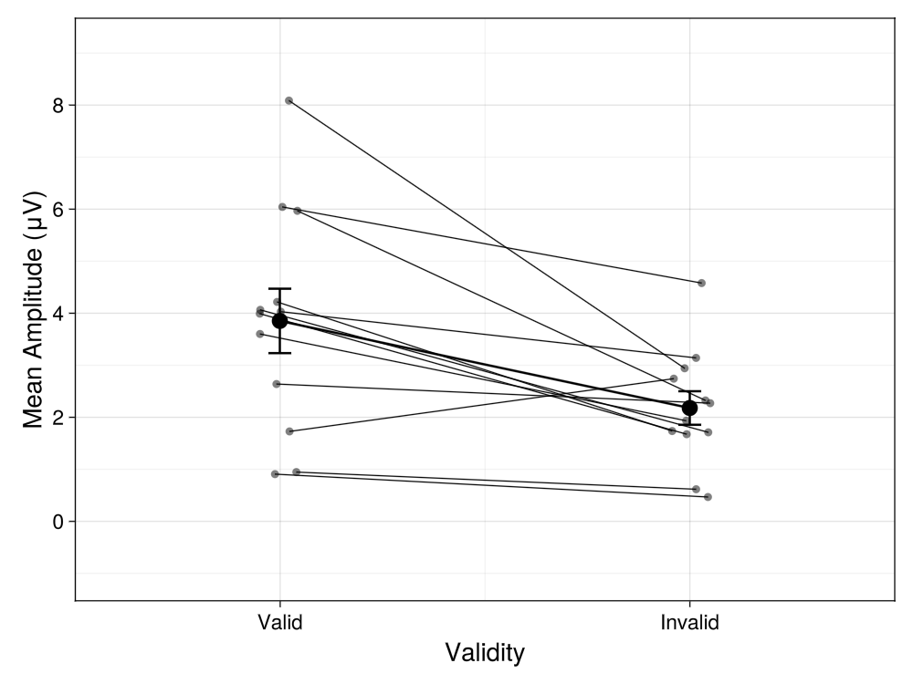

### 3.4 Permutation-Based Statistics

Cluster-based permutation tests address the multiple comparisons problem across channels and time points:

```julia

# Prepare data for statistical testing
stat_data = EegFun.prepare_stats(
    "erps_final",
    :paired;
    condition_selection = EegFun.conditions([1, 2]),   # Valid left vs. Invalid left
    channel_selection = EegFun.channels(1:72),
    baseline_interval = EegFun.times((-0.2, 0.0)),
    analysis_interval = EegFun.times((0.0, 0.3)),
)

# Run cluster-based permutation test
result_perm = EegFun.permutation_test(
    stat_data,
    n_permutations = 1000,
    cluster_type = :spatiotemporal,
    show_progress = true,
)

# ERP waveforms with significance 
EegFun.plot_erp_stats(
    result_perm,
    channel_selection = EegFun.channels([:PO7, :PO8, :O1, :O2]),
    plot_erp = true,
    plot_significance = true,
    plot_se = true,
    layout = :grid,
    channel_plot_order = [:O1, :O2, :PO7, :PO8],
    xlim = (-0.2, 0.5),
    ylim = (-6, 6),
    legend_labels = ["Valid", "Invalid"],
    xticks = -0.2:0.2:0.6,
    time_unit = :ms, 
    legend_framevisible = false
)

# Topographies with significance
EegFun.plot_topography_stats(result_perm, interval_selection = EegFun.times(0.05, 0.2), n_topos = 10, dims = (2, 5), highlight_threshold = 1)
```

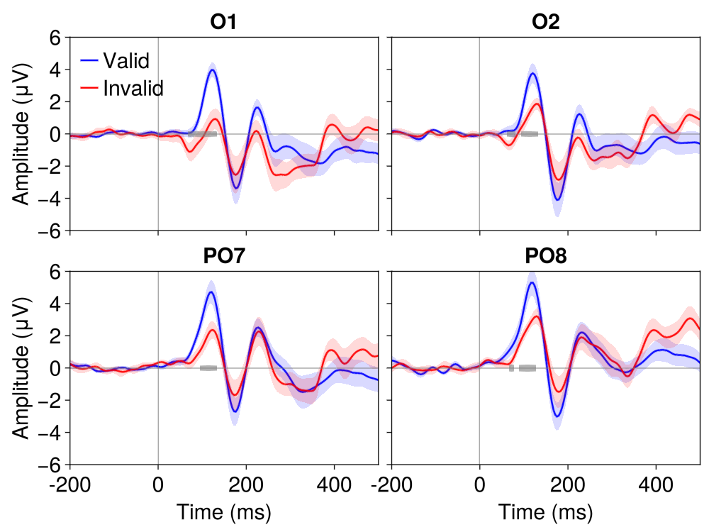
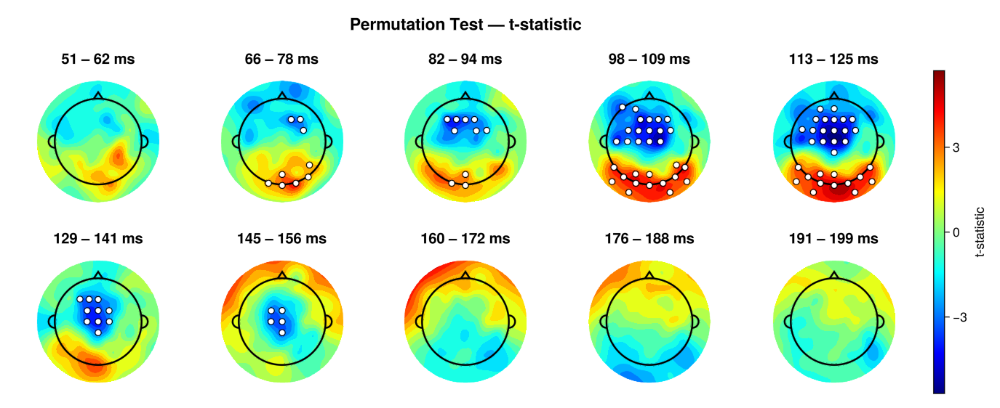

## Further Reading

- [Manual Preprocessing](../../tutorials/manual-preprocessing.md) — Rationale behind each preprocessing step
- [Batch Processing](../../tutorials/batch-processing.md) — `preprocess()` configuration
- [Selection Patterns](../../tutorials/selection-patterns.md) — The selector API
- [Artifact Handling](../../tutorials/artifact-handling.md) — Strategies for trial rescue

---

## References

- Mangun, G. R., & Hillyard, S. A. (1991). Modulations of sensory-evoked brain potentials indicate changes in perceptual processing during visual-spatial priming. *Journal of Experimental Psychology: Human Perception and Performance*, *17* (4), 1057–1074. [doi:10.1037/0096-1523.17.4.1057](https://doi.org/10.1037/0096-1523.17.4.1057)
- Posner, M. I. (1980). Orienting of attention. *Quarterly Journal of Experimental Psychology*, *32* (1), 3–25. [doi:10.1080/00335558008248231](https://doi.org/10.1080/00335558008248231)

---

## The Whole Code

All code from this tutorial combined for easy copy-paste.

::: details Part 1: Single Participant Exploration (click to expand)

```julia
using EegFun

# ── 1.1 Load Raw Data ──
dat = EegFun.read_raw_data("example1.bdf")
layout = EegFun.read_layout("biosemi72.csv")
dat = EegFun.create_eegfun_data(dat, layout)

# ── 1.2 Channel Layout and Neighbours ──
EegFun.plot_layout_2d(dat)
EegFun.get_neighbours_xy!(dat, 0.35)
EegFun.plot_layout_2d(dat, neighbours = true)

# ── 1.3 Inspect Triggers ──
EegFun.trigger_count(dat)
EegFun.plot_trigger_overview(dat)
EegFun.plot_trigger_timing(dat)

# ── 1.4 Browse the Raw Data ──
EegFun.plot_databrowser(dat)
EegFun.highpass_filter!(dat, 0.1)
EegFun.rereference!(dat, :avg)
EegFun.plot_databrowser(dat)

# ── 1.5 Derive EOG Channels ──
EegFun.channel_difference!(dat,
    channel_selection1 = EegFun.channels([:Fp1, :Fp2]),
    channel_selection2 = EegFun.channels([:IO1, :IO2]),
    channel_out = :vEOG,
)
EegFun.channel_difference!(dat,
    channel_selection1 = EegFun.channels([:F9]),
    channel_selection2 = EegFun.channels([:F10]),
    channel_out = :hEOG,
)
EegFun.detect_eog_onsets!(dat, 50, :vEOG, :is_vEOG)
EegFun.detect_eog_onsets!(dat, 50, :hEOG, :is_hEOG)

# ── 1.6 Visualise Epoch Regions ──
EegFun.mark_epoch_intervals!(dat, [5], [-0.5, 1.0])
EegFun.plot_databrowser(dat)

# ── 1.7 Channel Quality and Extreme Values ──
cs = EegFun.channel_summary(dat)
cs_epoch = EegFun.channel_summary(dat,
    sample_selection = EegFun.samples(:epoch_interval)
)
EegFun.plot_channel_summary(cs, :range)
EegFun.plot_channel_summary(cs, [:range, :min, :max, :var])
EegFun.plot_channel_summary(cs_epoch, :range)
EegFun.is_extreme_value!(dat, 200)
EegFun.plot_databrowser(dat)

# ── 1.8 Detect and Repair Bad Channels ──
cs = EegFun.channel_summary(dat,
    sample_selection = EegFun.samples(:epoch_interval)
)
jp = EegFun.channel_joint_probability(dat,
    sample_selection = EegFun.samples(:epoch_interval)
)
bad_channels = EegFun.identify_bad_channels(cs, jp)
EegFun.plot_databrowser(dat)  # Press R to open repair menu

# ── 1.9 ICA ──
EegFun.is_extreme_value!(dat, 250)
dat_ica = copy(dat)
EegFun.highpass_filter!(dat_ica, 1.0)
ica_result = EegFun.run_ica(dat_ica,
    sample_selection = EegFun.samples_not(:is_extreme_value_250)
)
EegFun.plot_topography(ica_result, component_selection = EegFun.components(1:10))
EegFun.plot_ica_component_activation(dat, ica_result)
EegFun.plot_databrowser(dat, ica_result)
component_artifacts, component_metrics = EegFun.identify_components(dat, ica_result,
    sample_selection = EegFun.samples_not(:is_extreme_value_250)
)
EegFun.plot_ica_component_activation(dat, ica_result, artifacts = component_artifacts)
all_removed = EegFun.get_all_ica_components(component_artifacts)
EegFun.remove_ica_components!(dat, ica_result,
    component_selection = EegFun.components(all_removed)
)

# ── 1.10 Define Epoch Conditions ──
epoch_conditions = [
    EegFun.EpochCondition(name = "valid_left",   trigger_sequences = [[1, 5]], reference_index = 2),
    EegFun.EpochCondition(name = "invalid_left",  trigger_sequences = [[2, 5]], reference_index = 2),
    EegFun.EpochCondition(name = "valid_right",  trigger_sequences = [[3, 5]], reference_index = 2),
    EegFun.EpochCondition(name = "invalid_right", trigger_sequences = [[4, 5]], reference_index = 2),
]

# ── 1.11 Extract Epochs ──
epochs = EegFun.extract_epochs(dat, epoch_conditions, (-1.0, 1.0))
EegFun.baseline!(epochs, (-0.2, 0.0))
EegFun.plot_epochs(epochs, condition_selection = EegFun.conditions(1), channel_selection = EegFun.channels(:PO7))
EegFun.plot_epochs(epochs, condition_selection = EegFun.conditions(1), layout = :grid)
EegFun.plot_epochs(epochs, condition_selection = EegFun.conditions(2), layout = :topo)

# ── 1.12 Reject Artifacts ──
rejection_info = EegFun.detect_bad_epochs_automatic(epochs, abs_criterion = 100.0, z_criterion = 0.0)
EegFun.plot_artifact_detection(epochs[1], rejection_info[1])
EegFun.plot_artifact_detection(epochs[2], rejection_info[2])
EegFun.channel_repairable!(rejection_info, epochs[1].layout)
EegFun.repair_artifacts!(epochs, rejection_info)
rejection_info2 = EegFun.detect_bad_epochs_automatic(epochs, abs_criterion = 100.0)
EegFun.detect_bad_epochs_interactive(epochs[1], artifact_info = rejection_info2[1], dims = (3, 3)))
epochs_final = EegFun.reject_epochs(epochs, rejection_info2)

# ── 1.13 Average and Plot Single-Participant ERPs ──
erps = EegFun.average_epochs(epochs_final)
EegFun.plot_erp(erps, channel_selection = EegFun.channels([:PO7, :PO8, :O1, :O2]))
EegFun.plot_topography(erps, interval_selection = EegFun.times(0.17))
```

:::

::: details Part 2: Batch Processing and Group Analysis (click to expand)

```julia
using EegFun

# ── 2.1 Batch Preprocessing ──
EegFun.preprocess("pipeline.toml")

# ── 2.2 Batch Filter ERPs ──
EegFun.lowpass_filter("erps_final", 30.0)

# ── 2.3 Grand Average ──
EegFun.grand_average("erps_final")

# ── 2.4 Create Condition Averages ──
EegFun.condition_average("erps_final", [[1, 3], [2, 4]],
    input_dir = "filtered_erps_final_lp_30.0hz"
)

# ── 2.5 Create Difference Waves ──
EegFun.condition_difference("erps_final", [(2, 1)],
    input_dir = "filtered_erps_final_lp_30.0hz/averages_erps_final_1-3_2-4"
)

# ── 2.6 Grand Average (Condition-Averaged) ──
EegFun.grand_average("erps_final",
    input_dir = "filtered_erps_final_lp_30.0hz/averages_erps_final_1-3_2-4"
)

# ── 2.7 Publication-Quality Plots ──
ga = EegFun.read_data(
    "filtered_erps_final_lp_30.0hz/averages_erps_final_1-3_2-4/grand_average_erps_final/grand_average_erps_final.jld2"
)
EegFun.plot_erp(ga, channel_selection = EegFun.channels([:PO7, :PO8, :O1, :O2]))
EegFun.plot_topography(ga, interval_selection = EegFun.times(0.1))    # P1
EegFun.plot_topography(ga, interval_selection = EegFun.times(0.17))   # N1

ga_diff = EegFun.read_data(
    "filtered_erps_final_lp_30.0hz/averages_erps_final_1-3_2-4/differences_erps_final_2-1/grand_average_erps_final/grand_average_erps_final.jld2"
)
EegFun.plot_erp(ga_diff, channel_selection = EegFun.channels([:PO7, :PO8, :O1, :O2]))
```

:::

::: details Part 3: Statistical Analysis (click to expand)

```julia
using EegFun, AnovaFun

# ── 3.1 ERP Measurement GUI ──
erps = EegFun.read_data("example1_erps_final.jld2")
EegFun.plot_erp_measurement_gui(erps)

# ── 3.2 Extract ERP Measurements ──
mean_amp = EegFun.erp_measurements(
    "erps_final",
    "mean_amplitude",
    input_dir = "output_data",
    condition_selection = EegFun.conditions([1, 2, 3, 4]),
    channel_selection = EegFun.channels([:PO7, :PO8, :O1, :O2]),
    analysis_interval = (0.15, 0.2),
    baseline_interval = (-0.2, 0.0),
)

# ── 3.3 Traditional Statistics ──
df = mean_amp.data
valid_po7   = (df[df.condition .== 1, :PO7] .+ df[df.condition .== 3, :PO7]) ./ 2
invalid_po7 = (df[df.condition .== 2, :PO7] .+ df[df.condition .== 4, :PO7]) ./ 2

result = paired_ttest(valid_po7, invalid_po7)
result.t   # t-statistic
result.p   # p-value

# ── 3.4 Permutation-Based Statistics ──
stat_data = EegFun.prepare_stats(
    "erps_final",
    :paired;
    condition_selection = EegFun.conditions([1, 2]),
    channel_selection = EegFun.channels(1:72),
    baseline_interval = EegFun.times((-0.2, 0.0)),
    analysis_interval = EegFun.times((0.0, 0.3)),
)

result_perm = EegFun.permutation_test(
    stat_data,
    n_permutations = 1000,
    cluster_type = :spatiotemporal,
    show_progress = true,
)

# ERP waveforms with significance
EegFun.plot_erp_stats(
    result_perm,
    channel_selection = EegFun.channels([:PO7, :PO8, :O1, :O2]),
    plot_erp = true,
    plot_significance = true,
    plot_se = true,
    layout = :grid,
    channel_plot_order = [:O1, :O2, :PO7, :PO8],
    xlim = (-0.2, 0.5),
    ylim = (-6, 6),
    legend_labels = ["Valid", "Invalid"],
    xticks = -0.2:0.2:0.6,
    time_unit = :ms,
    legend_framevisible = false
)

# Topographies with significance
EegFun.plot_topography_stats(result_perm, interval_selection = EegFun.times(0.05, 0.2), n_topos = 10, dims = (2, 5), highlight_threshold = 1)
```

:::
