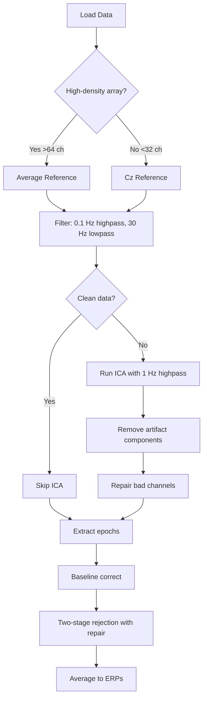

# Manual Preprocessing

While `EegFun.jl` provides the automated `preprocess()` pipeline for batch processing, you may want to manually control each step of preprocessing for exploration, customization, or teaching purposes. This tutorial explains the **why** and **when** behind each preprocessing step.

> [!TIP]
> See the [preprocessing_workflow demo](../tutorials/workflows/preprocessing_workflow.md) for a complete working example.
> The automated equivalent of this workflow is documented in [Batch Processing](batch-processing.md).

## The Preprocessing Philosophy

EEG preprocessing is a balancing act between **removing noise** and **preserving signal**. Every step involves trade-offs:

- Too lenient artifact rejection → contaminate your ERPs
- Over-reliance on ICA → remove brain activity that correlates with artifacts

The goal is to make data **cleaner** without making it **artificial**.

---

## Step-by-Step Rationale

### 1. Load Data and Configure Layout

```julia
dat = EegFun.create_eegfun_data(raw_data, layout)
EegFun.polar_to_cartesian_xy!(layout)   
EegFun.polar_to_cartesian_xyz!(layout)  
EegFun.get_neighbours_xy!(layout, 0.4)  
```

#### Why?

- **2D coordinates**: Required for topographic plots
- **3D coordinates**: Required for advanced interpolation (spherical spline)
- **Neighbors**: Pre-calculated for efficient channel repair

#### When to Customize?

- Adjust neighbour distance based on electrode density — the distance is in normalized units where 1.0 = the scalp equator. Think of it as a fraction of the head radius: 0.4 means "neighbours within 40% of the head radius"
- Higher density arrays (e.g., 128 channels) may need smaller radius (~0.3)

---

### 2. Mark Epoch Windows

```julia
EegFun.mark_epoch_intervals!(dat, epoch_cfg, [-0.2, 1.0])
```

#### Why?

Creates a boolean column `:epoch_interval` in your data, allowing you to:

- Exclude inter-trial intervals from artifact detection
- Focus EOG correlation analysis on epochs

#### When to Skip?

If you want to analyze the **entire recording** (e.g., resting-state data), skip this step.

---

### 3. Rereference BEFORE Filtering

```julia
EegFun.rereference!(dat, :avg)
```

#### Why This Order?

Rereferencing **before** filtering prevents reference channel artifacts from spreading during filtering. This is the `pipeline_v1` standard.

#### Common References:

- `:avg` - Average reference (recommended for dense arrays)
- `:Cz` - Central reference
- `[:M1, :M2]` - Linked mastoids (for auditory/language studies)

#### When to Customize?

- **Sparse arrays** (<32 channels): Use a specific channel like `:Cz`
- **Auditory ERPs**: Consider mastoid reference
- **High-density arrays** (≥64 channels): Average reference is ideal

---

### 4. Apply Initial Filters

```julia
EegFun.highpass_filter!(dat, 0.1)  # Remove DC drift (Biosemi Data Format)
EegFun.lowpass_filter!(dat, 30.0)  # Remove higher-frequency noise
```

#### Why Two Filters?

**High-pass (0.1 Hz)**:
- Removes slow voltage drifts
- Removes DC offsets
- **Critical** for stable baseline

**Low-pass (30 Hz)**:
- Removes muscle artifacts (>30 Hz)
- Removes line noise (50/60 Hz) + harmonics

#### When to Customize?

| Study Type | High-pass | Low-pass | Rationale |
|:---|:---:|:---:|:---|
| Standard ERPs | 0.1 Hz | 30 Hz | Preserve slow components (P300, etc.) |
| **ICA preprocessing** | 1.0 Hz | 40 Hz | ICA performs better with <1 Hz removed |
| Gamma analysis | 0.5 Hz | 100 Hz | Need high-frequency content |
| Infants/Children | 0.3 Hz | 20 Hz | More conservative filtering |

> [!WARNING]
> **Avoid** high-pass filtering above 0.5 Hz for standard ERP analyses — this can distort slow components like the P300.

---

### 5. Calculate EOG Channels

```julia
# vEOG = mean(Fp1, Fp2) - mean(IO1, IO2)
EegFun.channel_difference!(dat, 
    channel_selection1 = EegFun.channels([:Fp1, :Fp2]),
    channel_selection2 = EegFun.channels([:IO1, :IO2]),
    channel_out = :vEOG
)
```

#### Why?

- **vEOG**: Detects vertical eye movements (blinks)
- **hEOG**: Detects horizontal eye movements (saccades)

These channels help identify:

1. Bad channels that correlate with eye movements
2. ICA components that capture eye artifacts

#### When to Customize?a

If your montage doesn't have dedicated EOG electrodes, use:

- **vEOG**: `Fp1 - IO1` or just `Fp1` alone
- **hEOG**: `F7 - F8` or `F9 - F10`

---

### 6. Extract Initial "Original" Epochs

```julia
epochs_original = EegFun.extract_epochs(dat, epoch_cfg, (-0.2, 1.0))
```

#### Why?

Saving "original" epochs allows you to:

- Compare cleaned vs. uncleaned data
- Quantify artifact rejection effectiveness
- Verify that cleaning didn't distort the signal

#### When to Skip?

If disk space is limited or you're confident in your pipeline.

---

### 7. Detect Artifacts in Continuous Data

```julia
# Extreme artifacts (exclude from ICA)
EegFun.is_extreme_value!(dat, 250.0, channel_out = :is_extreme_value_100)

# Moderate artifacts (for epoch rejection)
EegFun.is_extreme_value!(dat, 75.0, channel_out = :is_artifact_value_75)
```

#### Why Two Thresholds?

**250 μV (strict)**: Excludes extreme sections from ICA training

- Prevents ICA from wasting components modeling saturated samples
- ICA works best on relatively clean data

**75 μV (lenient)**: Used later for epoch-level rejection

- More permissive during continuous processing
- Final judgment happens after ICA cleaning

---

### 8. Identify Bad Channels

```julia
summary = EegFun.channel_summary(dat, sample_selection = EegFun.samples(:epoch_interval))
cjp = EegFun.channel_joint_probability(dat, sample_selection = EegFun.samples(:epoch_interval))
bad_channels = EegFun.identify_bad_channels(summary, cjp)
```

#### Why?

Bad channels have:

- **High variance** (noisy)
- **Low variance** (dead/broken channels)
- **Extreme kurtosis** (spiky)
- **Low joint probability** (statistically deviant)

#### Why Repair Early?

Repairing bad channels **before** ICA prevents them from:

- Dominating ICA components
- Reducing effective rank of the data
- Creating spurious brain-artifact correlations

---

### 9. Run ICA

```julia
dat_ica = EegFun.subset(dat, channel_selection = EegFun.channels_not(bad_channels))
EegFun.highpass_filter!(dat_ica, 1.0)  # Stricter for ICA
ica_result = EegFun.run_ica(dat_ica, sample_selection = EegFun.samples_not(:is_extreme_value_100))
```

#### Why 1 Hz High-pass for ICA?

ICA assumes **stationarity**. Slow drifts (<1 Hz) violate this assumption and reduce ICA quality.

#### Why Remove Bad Channels First?

Bad channels:

- Reduce effective data rank
- Waste ICA components
- Create misleading component topographies

#### When to Skip ICA?

- Very clean data (no eye movements)
- Low channel count (<32 channels)

---

### 10. Repair Bad Channels

```julia
EegFun.repair_channels!(dat, bad_channels, method = :neighbor_interpolation)
```

#### Why After ICA?

Prevents bad channel noise from:

- Contaminating ICA decomposition
- Creating spurious component correlations

#### Methods:

- `:neighbor_interpolation` - Fast, works in 2D
- `:spherical_spline` - Higher quality, requires 3D coordinates

---

### 11. Recalculate EOG After ICA

```julia
EegFun.channel_difference!(dat, ...)  # Recalculate vEOG and hEOG
```

#### Why?

ICA component removal **changes** the underlying channel data. EOG channels must be recalculated to reflect the cleaned data.

---

### 12. Extract Epochs from Cleaned Data

```julia
epochs = EegFun.extract_epochs(dat, epoch_cfg, (-0.2, 1.0))
```

Now extracting from **ICA-cleaned**, **channel-repaired** continuous data.

---

### 13. Baseline Correction

```julia
EegFun.baseline!(epochs)  # Defaults to entire epoch
```

#### Why Before Rejection?

Baseline correction removes DC offsets that could bias artifact detection statistics.

#### When to Customize?

```julia
EegFun.baseline!(epochs, (-0.2, 0.0))  # Only pre-stimulus interval
```

Use pre-stimulus baseline for:

- Standard ERP analyses
- Comparing conditions with different baselines

---

### 14-17. Two-Stage Epoch Rejection

```julia
# Stage 1: Detect bad epochs
rejection_info_step1 = EegFun.detect_bad_epochs_automatic(epochs, abs_criterion = 75.0)

# Stage 2: Repair bad channels within epochs
EegFun.repair_artifacts!(epochs, rejection_info_step1)

# Stage 3: Re-detect after repair
rejection_info_step2 = EegFun.detect_bad_epochs_automatic(epochs, abs_criterion = 75.0)

# Stage 4: Reject remaining bad epochs
epochs_clean = EegFun.reject_epochs(epochs, rejection_info_step2)
```

#### Why Two Stages?

Many "bad" epochs have only 1-2 bad channels. Repairing those channels **rescues** trials that would otherwise be rejected.

**Typical outcomes**:

- 20% of epochs initially flagged
- 50% of those rescued via repair
- Only 10% actually rejected

---

## Common Pitfalls

### 1. Over-Filtering

**Problem**: High-pass filtering at 1 Hz for ERP analysis distorts slow components.
**Solution**: Use 0.1 Hz for ERPs, 1 Hz only for ICA preprocessing.

### 2. Skipping ICA

**Problem**: Eye blinks contaminate frontal electrodes.
**Solution**: Always run ICA unless you have very clean data.

### 3. Not Recalculating EOG

**Problem**: EOG channels contain removed ICA components.
**Solution**: Always recalculate EOG after ICA.

### 4. Rejecting Too Many Trials

**Problem**: Less than X (component dependent) trials per condition → unstable ERPs.
**Solution**: Lower artifact thresholds or improve recording quality.

---

## Decision Flow



---

## Summary

| Step | When to Customize | Key Parameter |
|:---|:---|:---|
| **Rereference** | Sparse arrays, auditory studies | `:avg` vs `:Cz` vs `[:M1,:M2]` |
| **High-pass** | ICA vs ERP analysis | 0.1 Hz (ERP), 1.0 Hz (ICA) |
| **Low-pass** | Gamma vs ERP analysis | 30 Hz (ERP), 100 Hz (gamma) |
| **Artifact threshold** | Clean vs noisy recordings | 75 μV (typical), 50-150 μV range |
| **ICA** | Very clean data or <32 ch | Skip if no eye artifacts |
| **Baseline** | Stimulation timing | Entire epoch vs pre-stimulus |

---

## Further Reading

- **Artifact detection** — [Artifact Handling](artifact-handling.md) for detecting and repairing bad channels and epochs
- **Automating this workflow** — [Batch Processing](batch-processing.md) for running `preprocess` across a full cohort
- **Selection syntax** — [Selection Patterns](selection-patterns.md) for channel, sample, and epoch filters used throughout preprocessing
- **Working example** — [Preprocessing Workflow demo](../tutorials/workflows/preprocessing_workflow.md)
