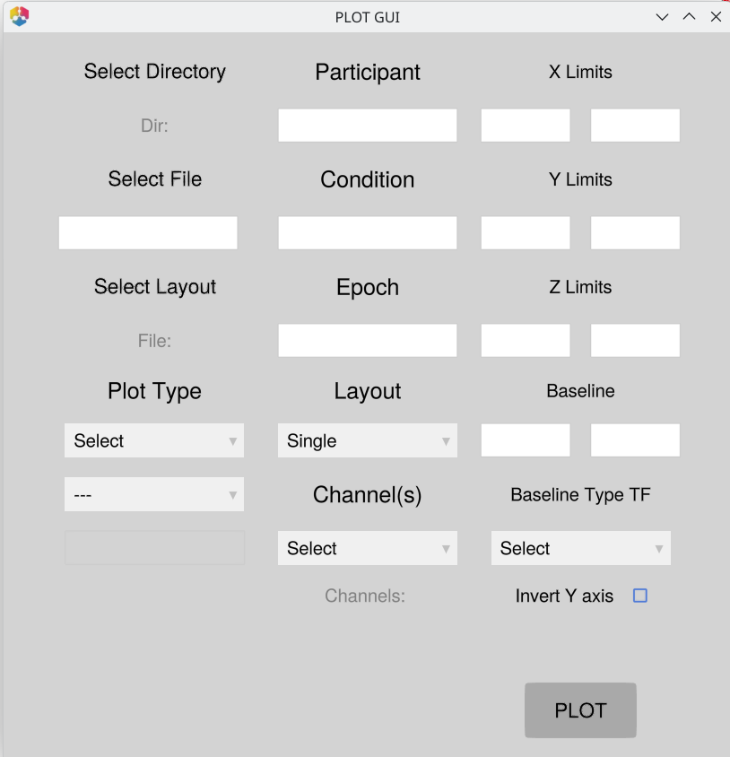

# Plot GUI

The Plot GUI is a quick-access point for interactively exploring your EEG data. Launch it with a single command and use it to inspect any raw EEG file or saved JLD2 data file — or an entire batch of files at once using filename patterns.

## Launching the GUI

```julia
using EegFun
EegFun.plot_gui()
```

A window opens with three columns allowing file selection, plot selection, and plot setting type controls.



## GUI Layout

The window is divided into three columns.

### Column 1 — File & Plot Selection

| Control | Description |
| --- | --- |
| Select Directory | Sets the working directory used for batch file discovery |
| *(directory label)* | Shows the currently selected directory path |
| Select File | Opens a file picker to choose a `.jld2` or raw EEG file |
| *(file / pattern box)* | Type a filename, full path, or batch pattern directly |
| Select Layout | Opens a file picker to load an electrode layout (`.csv`) |
| *(layout label)* | Shows the currently loaded layout filename |
| Plot Type | Dropdown — direct plots or category submenus (*ICA >*, *ERP Analysis >*, *Diagnostic Plots >*) |
| *(submenu)* | Appears when a category is selected; choose the specific plot type |
| *(components box)* | Active only for ICA plots — enter component numbers to plot |

### Column 2 — Data Filters

| Control | Description |
| --- | --- |
| Participant | Space/comma-separated integers or ranges (e.g. `1 2 3` or `1:10`) |
| Condition | Condition numbers to include; blank = all |
| Epoch | Epoch numbers to include; blank = all |
| Layout | Plot layout: *Single*, *Single Avg*, *Grid*, *Topo* |
| Channel(s) | Multi-select menu (populated when a layout is loaded) |
| *(selected label)* | Shows the currently selected channels |

### Column 3 — Axis Settings

| Control | Description |
| --- | --- |
| X Limits | Min / max for the time axis |
| Y Limits | Min / max for the amplitude axis |
| Z Limits | Min / max for the colour axis (TF and ERP Image) |
| Baseline | Start / end times in seconds for baseline correction |
| Baseline Type TF | Baseline normalisation method for Time-Frequency plots |
| Invert Y axis | Checkbox — flips the Y axis (ERP, Epochs, ERP Image) |
| PLOT | Triggers the selected plot |

## Step-by-Step: Plotting a Single File

### 1. Pick a directory

Click **Select Directory** to set the working directory.

For **batch mode** (pattern input) this is essential — it tells the GUI where to search for matching files. If left unset, the GUI falls back to `pwd()`, which is the directory Julia was launched from and is rarely where your data lives.

For **single-file mode** (Select File picks a full path) the directory is not required.

### 2. Select a file

Either:

- Click **Select File** and navigate to a `.jld2` or raw EEG file, or
- Type the filename directly into the text box.

The text box accepts full paths, relative paths, or just a filename if the directory is already set.

### 3. Choose a plot type

Click the **Plot Type** dropdown and select one of the direct plot types:

| Selection | Produces |
| --- | --- |
| Data Browser | Interactive scrollable signal browser |
| Epochs | Epoch-level waveform viewer |
| ERP | ERP waveforms |
| ERP Image | Heatmap of individual epochs |
| Topography | Scalp topographic map |
| Time-Frequency | Time-frequency power plot |

For more specialised plots, select a **category** to reveal a submenu:

| Category | Submenu options |
| --- | --- |
| **ICA >** | Components (topographies), Activation (time-course) |
| **ERP Analysis >** | ERP GUI |
| **Diagnostic Plots >** | Channel Summary, Layout View |

### 4. Configure controls (optional)

All controls are optional — leave them blank to use sensible defaults.

**X / Y / Z limits** — Enter a min and max value in the paired text boxes to constrain the plotted time range (X), amplitude scale (Y), or colour scale (Z). Both boxes must be filled for the limit to apply.

**Baseline** — Enter start and end times in seconds (e.g. `-0.2` and `0.0`) and choose a correction method from the dropdown.

**Channels** — If a layout file is loaded, pick one or more channels from the Channels menu. Click **Select** to clear the selection.

**Layout** — Choose how channels are arranged:

- *Single* — all selected channels overlaid on one axis
- *Grid* — one axis per channel in a grid
- *Topo* — channels positioned according to their electrode locations
- *Single Avg* — channels averaged together before plotting

**Invert Y axis** — Tick this checkbox to plot positive deflections downward, matching the neurophysiology convention used in some ERP labs. Applies to ERP, Epochs, and ERP Image plots.

### 5. Click Plot

Click the **Plot** button. The plot opens in a new window.

---

## Batch Mode (Pattern Input)

Instead of a single filename, type a **filename pattern** into the file box. EegFun will discover all matching `.jld2` files in the selected directory and plot them one after another.

```text
# Example: type this into the file box
erps_final
```

This matches any file containing `erps_final` in the directory (e.g. `01_erps_final.jld2`, `02_erps_final.jld2`, …).

### Filtering by participant

Enter participant numbers in the **Participant** box (space- or comma-separated integers, or ranges):

```text
1 2 3         # participants 1, 2, and 3
1:10          # participants 1 through 10
1 3 5:8       # mixed
```

If the box is empty, all matching participants are plotted.

### Filtering by condition

Enter condition numbers in the **Condition** box using the same syntax. Leave blank to plot all conditions.

> [!TIP]
> If you enter a participant ID that does not exist in the discovered files, the GUI will warn you and list the available IDs before plotting.

---

## ICA Plots

Select **ICA >** from the Plot Type dropdown to see two options.

**Components** — Plots the ICA component topographies. The file must be an `InfoIca` `.jld2` produced by `run_ica()`.

**Activation** — Plots the ICA component activation time-courses. The GUI automatically locates the original EEG source file from the path stored inside the `InfoIca` object. If the source file is a raw format (`.bdf`, `.set`, `.vhdr`), a 0.1 Hz high-pass filter and average rereference are applied automatically before plotting.

Use the **Components** text box to restrict which components are shown:

```text
1:10          # first ten components
1 3 5         # specific components
              # (blank = all components)
```

---

## Layout File

Some plot types (Data Browser with a raw `.bdf` file, Layout View) require an electrode layout. Click **Select Layout** to load a `.csv` layout file. The channel list in the Channels menu is then populated from the layout.


---

## Tips

- **Data Browser** with a `.bdf` file requires a layout to be loaded.
- **Z limits** apply only to Time-Frequency and ERP Image plots (colour axis).
- **Baseline** fields apply to ERP and Time-Frequency plots.
- The GUI state is preserved between plots — change one setting at a time to compare results.
- If a plot fails, a brief warning appears in the Julia REPL. The GUI remains open and usable.

## Next Steps

- **Preprocessing your data** — [Manual Preprocessing](manual-preprocessing.md) or [Batch Processing](batch-processing.md) to produce clean epochs and ERPs to explore in the GUI
- **Layouts** — [Layouts and Neighbours](layouts-neighbors.md) for loading the layout file required by topographic and data browser plots
- **Artifact review** — [Artifact Handling](artifact-handling.md) for the `detect_bad_epochs_interactive` GUI workflow
