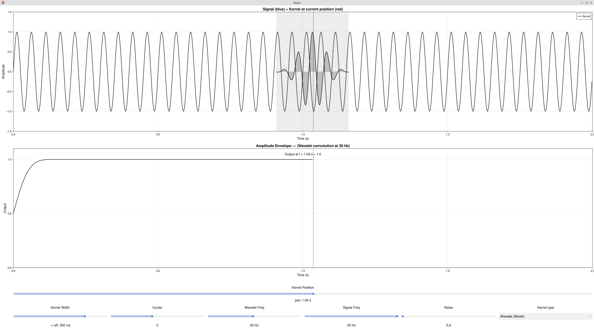

# Signal Example — Convolution

Interactive demo showing discrete convolution by sliding a kernel across a signal, with three kernel types including a Morlet wavelet to bridge filtering and time-frequency analysis.



## What it shows

| Row | Plot | Description |
|-----|------|-------------|
| 1 | Signal + Kernel | The input signal with the kernel overlaid at the current position — the shaded band marks the overlap region. |
| 2 | Output | The convolution result accumulated up to the current kernel position. For the Wavelet kernel, this is the amplitude envelope. |

## Key Concept

Convolution computes, at each time point *t*, the weighted sum of the signal under the kernel:

```math
(x * h)[t] = \sum_{\tau} x[\tau] \cdot h[t - \tau]
```


**Gaussian:** smooth low-pass filter — noise suppressed, slow waves preserved.

**Boxcar:** running average — same idea but with sharper edges in frequency.

**Wavelet (Morlet):** `Gaussian × cos(2πfτ)` — the kernel is frequency-selective. The output is the amplitude envelope: how much of *Wavelet Freq* is present at each time point. This is one row of a time-frequency spectrogram.

## Controls

| Control | Applies to | Description |
|---------|------------|-------------|
| Kernel Position | All | Scrub the kernel across the signal — output builds up as you drag right |
| Kernel Width | Gaussian / Boxcar | Total span of the kernel (label updates to "→ eff. X ms" in Wavelet mode) |
| Cycles | Wavelet | Number of oscillations in the kernel — more cycles = better frequency resolution, worse time resolution |
| Wavelet Freq | Wavelet | The target frequency to detect |
| Signal Freq | All | Frequency of the input signal |
| Noise | All | Additive Gaussian noise |
| Kernel type | All | Switch between Gaussian, Boxcar, Wavelet (Morlet) |

## Things to Try

1. **Low-pass filtering:** Gaussian kernel, drag position to end — output is a smoother version of the noisy input.
2. **Kernel width effect:** Gaussian, widen the kernel → noise disappears, but the sine is also attenuated as the kernel begins to span whole cycles.
3. **Switch to Wavelet Freq = Signal Freq** → amplitude envelope is near 1.0 (frequency detected).
4. **Mismatch frequencies** (e.g. Wavelet = 8 Hz, Signal = 4 Hz) → envelope near 0.
5. **Cycles tradeoff:** with two nearby signal frequencies, fewer cycles blurs them together; more cycles separates them.
6. **Link to Gaussian:** set Kernel Width = value shown in "→ eff. X ms" label, then switch kernel type — you will see the same Gaussian envelope.

## See Also

- [Signal Example — Composition](signal_example_composition.md) — building signals from sine waves
- [Signal Example — Dot Product](signal_example_dotproduct.md) — the core dot product mechanism
- [Signal Example — Time-Frequency](signal_example_tf.md) — running Morlet convolution at every frequency
- Cohen, M. X. (2014). *Analyzing Neural Time Series Data*. MIT Press. — Chapter 11/12

## Code

```julia
using EegFun
EegFun.signal_example_convolution()
```
